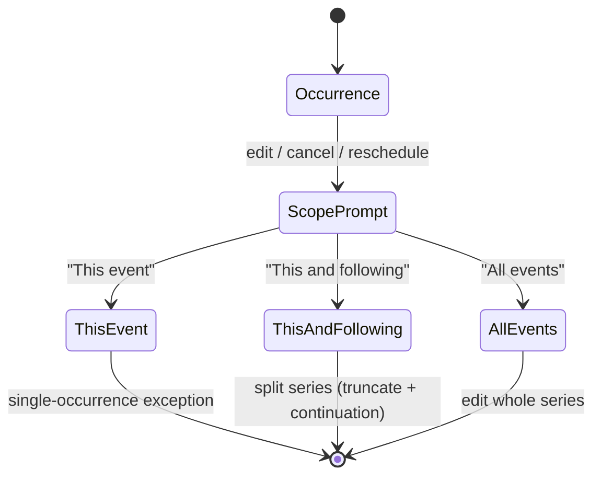
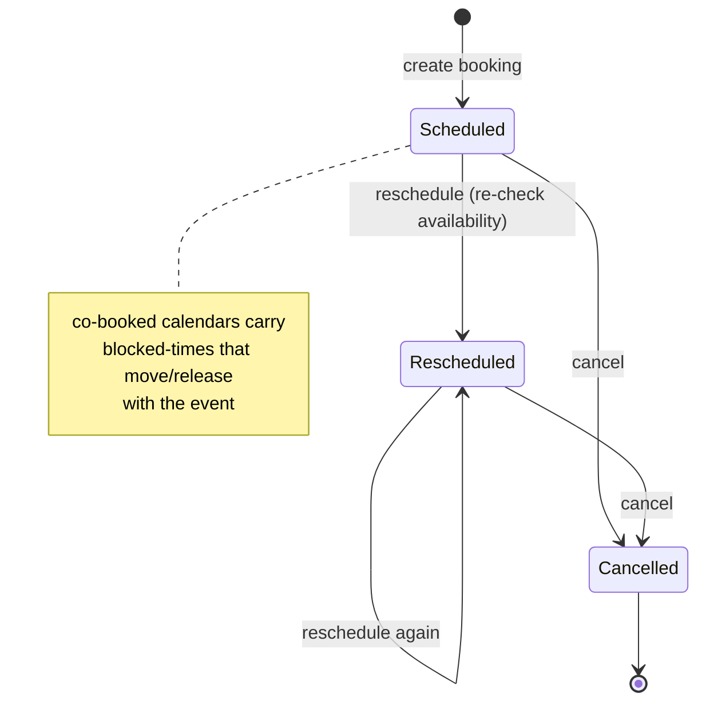

# Integrate with private REST API — Spec

## 1. Business Context

The scheduling platform exposes a mature, multi-tenant backend: organizations and memberships, personal/resource/virtual/bundle calendars, single and recurring events, multi-calendar Calendar Groups, availability and blocked-time declarations, external-provider sync (Google/Microsoft and others) with webhook health, and an external GraphQL API with scoped tokens. Today this capability is reachable only through the REST and GraphQL APIs and the Django admin. There is no end-user application surface for the day-to-day work the platform was built for.

A separate frontend application already exists and already handles **authentication** (Allauth headless email/password + OAuth, JWT) and **organization onboarding** (creating an organization, accepting an invitation, the org-less gate). What it does _not_ yet have is the operational feature set: team and invitation management, calendar and event views, booking flows (single, recurring, group), availability editing, calendar groups and bundles administration, external sync controls, admin user/calendar management, and GraphQL API-token management.

The customer is two roles inside a single organization:

- **Members** — the people who live in their calendars day to day: viewing events, booking, managing their own availability and calendars, checking colleagues' availability.
- **Admins** — members with elevated rights who run the organization: managing the team and invitations, defining Calendar Groups and Bundles, configuring and triggering syncs, disabling users/calendars, transferring events, and issuing/revoking API tokens.

Cost of doing nothing: the backend's investment is unrealized because no one but an engineer with API access can use it. Every workflow below is currently a support task, a script, or simply impossible for the customer to self-serve.

This is one feature — "the application's operational surface" — specified as one document because the use-cases share navigation, data-fetching, permission gating, datatable, and calendar-view infrastructure.

## 2. Hypothesis (to be validated)

Not a hypothesis — **known requirement**. The backend is built and the company has committed to shipping a usable product on top of it. Success is measured by definition-of-done (every listed use-case works, end to end, for the correct role), not by validating an uncertain bet. There is no kill criterion and no rollback-on-metric; the work ships because the product cannot exist without it.

## 3. Objectives (and definition of done)

Each objective is "done" when the named use-cases are usable by the correct role against the live API, with loading/empty/error states and timezone-correct rendering.

1. **Team & invitation management (admin).** Admin can view the team in a searchable, paginated datatable; view pending invitations; invite a new member; resend a pending invitation; revoke a pending invitation; disable a member.
   - Done when: each action calls the API, reflects the result, and a disabled user can no longer access the app.

2. **Calendar event viewing (member).** Any user can view their events as a list and as a month and week calendar, and can view the events of one specific calendar.
   - Done when: list, month, and week render the same underlying events; each event shows in its own timezone correctly; switching the scoped calendar refilters.

3. **Calendar management (member).** Any user can create a calendar for themselves, list their calendars, disable one of their calendars, and request a calendar to sync.
   - Done when: create/list/disable round-trip through the API; a disabled calendar stops appearing in active pickers; "request sync" fires the backend job and confirms it started.

4. **Booking (member).** Any user can create a single booking (selecting additional calendars to book alongside), create a recurring booking, book on a Calendar Group (selecting the calendars that satisfy each slot), manage an event's attendees (internal users, external attendees, resource allocations), cancel a booking, and reschedule a booking.
   - Done when: each flow produces the correct event(s) and side-effect blocked-times; conflicts are surfaced (see **Decisions → State transitions & edge cases**).

5. **Recurring-event editing (member).** Any user can adjust one instance, one instance and beyond, or all instances of a recurring event — for edit, cancel, and reschedule.
   - Done when: a scope prompt appears on every recurring-event mutation and the chosen scope maps to the correct backend operation (single-occurrence exception, series split, or whole-series edit).

6. **Availability (member).** Any user can edit their own availability, create blocked times on their own availability, and check another user's availability.
   - Done when: availability and blocked-time edits round-trip; another user's free/busy is viewable without exposing private event detail beyond what the API returns.

7. **Calendar Groups (admin).** Admin can list the organization's Calendar Groups and create a new one (named slots, required counts, candidate calendar pools).
   - Done when: list and create round-trip; a created group is immediately bookable by members.

8. **Calendar Bundles (admin).** Admin can create, update, and disable a Calendar Bundle, and list all calendars including resources and bundles.
   - Done when: bundle CRUD round-trips; the all-calendars datatable distinguishes personal/resource/virtual/bundle.

9. **External & rooms sync (admin).** Admin can configure the organization to sync rooms, trigger a rooms sync, and manually trigger a sync of another user's calendar.
   - Done when: configuration saves; each trigger fires the backend job and confirms via toast ("sync started").

10. **Admin event control.** Admin can transfer an event from any user's calendar to another user's calendar.
    - Done when: the event moves; both source and destination calendars reflect the change.

11. **GraphQL API tokens (admin).** Admin can generate a new API token with permission scopes (secret shown once) and invalidate an existing token.
    - Done when: a generated token is usable against the GraphQL API within its scopes; an invalidated token is rejected; the secret is never re-displayed after creation.

## 4. Decisions

### 4.1 Use-cases

Each entry: **actor — trigger — flow — outcome.** "API" means the REST surface by default; GraphQL is named explicitly where it is the source (group availability, bookable slots, computed availability windows, API-token management).

#### Team & invitations

1. **List team (admin).** Admin opens the Team page → app loads org users into a datatable with search, filter, sort, pagination → admin sees members with role and status.
2. **List pending invitations (admin).** Admin opens the Invitations tab → app loads pending invitations (email, expiry, status) → admin sees who has been invited and not yet joined.
3. **Invite a member (admin).** Admin clicks Invite → enters email (and role) → submits → API creates an invitation → new pending row appears.
4. **Resend an invitation (admin).** Admin clicks Resend on a pending invitation → API re-issues/re-sends → confirmation toast; expiry refreshes.
5. **Revoke an invitation (admin).** Admin clicks Revoke on a pending invitation → confirm → API cancels it → row leaves the pending list.
6. **Disable a user (admin).** Admin clicks Disable on a member → confirm → API deactivates the user → member can no longer access the app; row shows disabled.

#### Calendars

7. **List my calendars (member).** Member opens Calendars → datatable of their calendars (type, provider, sync state, active/disabled).
8. **Create a calendar (member).** Member clicks New Calendar → enters name/type/options → submits → API creates a personal calendar owned by them → appears in list and pickers.
9. **Disable a calendar (member).** Member clicks Disable on one of their calendars → confirm → API disables it → it stops appearing in active pickers; remains in list as disabled.
10. **Request a calendar to sync (member).** Member clicks Sync on a calendar → API triggers a sync job → toast "sync started"; member refreshes to see imported events.
11. **List all calendars incl. resources & bundles (admin).** Admin opens All Calendars → datatable across the org showing personal, resource, virtual, and bundle calendars, filterable by type.

#### Events

12. **View events as a list (member).** Member opens Events (list) → app loads events in the visible range → chronological list with timezone-correct times.
13. **View events as a month calendar (member).** Member switches to Month → mature calendar component renders the month grid with events.
14. **View events as a week calendar (member).** Member switches to Week → component renders the week grid with events.
15. **View events for one specific calendar (member).** Member selects a single calendar in the scope picker → all three views refilter to that calendar's events.

#### Bookings

16. **Create a single booking with co-booked calendars (member).** Member clicks New Booking → picks date/time, title, attendees, and any additional calendars that must be booked alongside → app checks availability of all selected calendars → submits → API creates the event and the side-effect blocked-times on co-booked calendars.
17. **Create a recurring booking (member).** Member enables Repeat in the booking form → sets frequency/interval/end (RFC-5545-style options) → submits → API creates the event with its recurrence rule.
18. **Book on a Calendar Group (member).** Member opens a Calendar Group → picks a time (optionally guided by bookable-slot suggestions from GraphQL) → for each slot, picks the required number of calendars from that slot's pool, validated against per-slot availability (GraphQL group-availability) → submits → API creates the event on the primary calendar and blocked-times on the others, recording which calendars satisfied which slot.
19. **Manage attendees on an event (member).** On an event, member adds/removes internal attendees, external attendees, and resource allocations → API updates attendance records.
20. **Cancel a booking (member).** Member opens an event → Cancel → confirm → API cancels the event and releases its co-booked blocked-times.
21. **Reschedule a booking (member).** Member opens an event → Reschedule → picks new time → app re-checks availability → API moves the event (and its co-booked blocked-times).

#### Recurring-event scope edits

22. **Adjust one instance (member).** On a recurring occurrence, member chooses an action (edit/cancel/reschedule) → scope prompt → picks "This event" → API records a single-occurrence exception.
23. **Adjust this and following (member).** Same trigger → picks "This and following" → API splits the series at this occurrence (truncate original, create continuation with the change).
24. **Adjust all instances (member).** Same trigger → picks "All events" → API edits the whole series.

#### Availability

25. **Edit my availability (member).** Member opens My Availability → adds/edits available-time windows (weekly patterns and ad-hoc dates) → API saves; computed availability reflects the change.
26. **Create blocked times (member).** Member opens My Availability → adds a blocked time (one-off or recurring) → API saves; member shows busy in that window.
27. **Check another user's availability (member).** Member opens a colleague → selects a date range → app loads that user's availability/blocked/computed-availability windows (GraphQL) → member sees free/busy.

#### Calendar Groups (admin)

28. **List Calendar Groups (admin).** Admin opens Calendar Groups → datatable of the org's groups.
29. **Create a Calendar Group (admin).** Admin clicks New Group → names the group, defines slots (name + required count) and the candidate calendar pool per slot → submits → API creates the group → it becomes bookable.

#### Calendar Bundles (admin)

30. **Create a bundle (admin).** Admin clicks New Bundle → names it, selects child calendars, marks one primary → submits → API creates the bundle calendar.
31. **Update a bundle (admin).** Admin edits a bundle's children/primary/name → submits → API updates it.
32. **Disable a bundle (admin).** Admin disables a bundle → confirm → API disables it → it stops appearing in active pickers.

#### Sync & rooms (admin)

33. **Configure rooms sync (admin).** Admin opens Sync Settings → enables/configures rooms (resource) sync for the org → API saves configuration.
34. **Trigger a rooms sync (admin).** Admin clicks Sync Rooms → API fires the job → toast "sync started".
35. **Manually sync another user's calendar (admin).** Admin selects a user's calendar → Sync → API fires the job → toast "sync started".

#### Admin event control

36. **Transfer an event between users' calendars (admin).** Admin opens any event → Transfer → picks destination calendar → confirm → API moves the event → source and destination reflect the move.

#### GraphQL API tokens (admin)

37. **Generate an API token with permissions (admin).** Admin opens API Tokens → New Token → names it and selects permission/resource scopes → submits → GraphQL issues the token → **secret is shown once** with copy-to-clipboard and a warning it will not be shown again → token metadata appears in the list.
38. **Invalidate an API token (admin).** Admin clicks Invalidate on a token → confirm → API revokes it → token is rejected on subsequent API calls; list marks it invalidated.

### 4.2 State transitions & edge cases

#### Recurring-event edit scope (Google-Calendar-style prompt)

Every edit, cancel, or reschedule on an event that belongs to a recurrence rule **must** prompt for scope before applying. Non-recurring events skip the prompt.

#### Booking conflict handling — warn but allow override

When a booking (single, recurring, or group) targets a window where one or more selected calendars are busy or outside availability, the app does **not** silently proceed and does **not** hard-block by default. It surfaces the conflict — which calendar/slot conflicts and why (existing event, blocked time, outside available window, group slot unsatisfiable) — and offers nearest free alternatives (group bookable-slots from GraphQL where applicable). The user may override and submit where the backend permits it (e.g. resource capacity allows it); where the backend rejects the write, the rejection is surfaced as an error. The frontend never overwrites or deletes a conflicting event on the user's behalf.

#### Booking lifecycle

#### Async sync — fire-and-toast

Sync actions (request-calendar-sync, rooms sync, manual sync of another user's calendar) are backend jobs. The UI fires the trigger, shows a toast ("sync started"), and does not block or live-track. The user refreshes the relevant view to see results. Webhook-health surfacing is **not** required in v1 (see **Negative scope**).

#### Idempotency

- **Invitations:** inviting the same email twice does not create a duplicate active invitation — the app surfaces the existing pending invitation and offers Resend instead. Resend is idempotent in effect (one outstanding invitation per email).
- **Sync triggers:** double-clicking Sync must not enqueue duplicate user-visible work — the trigger control disables/debounces until the request returns.
- **Booking submit:** the submit control disables on first click to prevent double-submission (double-booking) from a double-click; the backend remains the authority on duplicates.

#### Concurrency

Two admins editing the same group/bundle, or two members touching overlapping calendars, rely on the backend's write semantics; the app surfaces backend rejections as errors rather than masking them. The app does not implement its own optimistic-locking UI in v1 (see **Open questions**).

#### Permission gating

- Member-only and admin-only routes/controls are gated by the signed-in user's organization role. Admin-only: team, invitations, all-calendars, calendar groups admin, bundles, sync settings/triggers, manual sync of others, event transfer, API tokens, disable-user.
- A disabled user is denied access on next request; the app routes them out.
- The org-less gate (create-org / accept-invite) is already implemented and out of scope here.

#### Cross-cutting view states (apply to every screen)

- **Loading:** skeletons/spinners for datatables and calendar views.
- **Empty:** explicit empty states (no events, no calendars, no invitations, no tokens).
- **Error:** error toasts/inline messages surfacing backend rejections; no silent failures.
- **Timezone:** events render in their own stored timezone, correctly; ranges sent to the API are timezone-correct. Mixed-timezone lists are unambiguous about which zone each row is in.
- **Datatables** (team, calendars, all-calendars, groups, bundles, tokens, invitations) provide search, filter, sort, and pagination.

### 4.3 Acceptance scenarios

1. **Happy — single booking with co-booked calendar.** Given a member with two free calendars in a window, when they create a booking selecting both, then one event is created on the primary calendar and the other calendar shows a blocked-time for the same window.

2. **Happy — recurring scope, this-and-following.** Given a weekly recurring event, when the member reschedules an occurrence and picks "This and following", then that occurrence and all later ones move while earlier ones are unchanged.

3. **Error — invite duplicate email.** Given an email with an outstanding pending invitation, when an admin invites that email again, then the app does not create a second invitation and instead surfaces the existing one with a Resend action.

4. **Edge — booking conflict with override.** Given a member books a window where a selected calendar already has an event, when they submit, then the app shows the conflict and nearest free slots; if they choose to override and the backend permits it, the booking succeeds; if the backend rejects it, an error is surfaced and no event is created.

5. **Edge — group slot selection.** Given a Calendar Group with a "Rooms" slot requiring one of three rooms and a "Physicians" slot requiring one of four doctors, when a member books a time where only some candidates are free, then only the free candidates are selectable per slot, and submitting with an unsatisfiable slot is prevented.

6. **Admin — generate then invalidate token.** Given an admin generates an API token with read-only scopes, when they copy the once-shown secret and use it, then GraphQL accepts it within scope; when they later invalidate it, then subsequent calls with that token are rejected and the secret is never re-displayed in the UI.

7. **Admin — disable user.** Given an active member, when an admin disables them, then that member is denied app access on their next request and appears disabled in the team datatable.

8. **Member — view parity across views.** Given a set of events in a date range, when the member switches between list, month, and week, then the same events appear in each, each in its correct timezone, and scoping to a single calendar refilters all three.

### 4.4 Negative scope

- **Authentication and login UI** — already implemented; out of scope.
- **Organization creation, invitation acceptance, and the org-less gate** — already implemented; out of scope.
- **Live/real-time calendar updates** — sync is fire-and-toast with manual refresh; no websockets/polling-to-live-update in v1.
- **Webhook-health dashboards** — subscription expiry/event-success-rate diagnostics are not surfaced in v1 (data exists in GraphQL; deferred).
- **In-app optimistic-locking / conflict-merge UI** — concurrent-edit collisions surface as backend errors; no merge UX in v1.
- **Billing/payments UI** — the payments surface is out of scope for this spec.
- **Building a calendar component from scratch** — a mature calendar library is assumed; no custom grid engine.
- **Notification preferences / email template management** — out of scope; the app only triggers backend actions.
- **Backend/API changes** — this spec assumes the existing REST/GraphQL surface; any missing endpoint is an Open question, not a frontend invention.
- **Cross-organization / super-admin tooling** — single-org scope only.

## 5. Alternatives considered

- **GraphQL-primary instead of REST-primary.** Rejected as the default: REST has the broader CRUD coverage today (calendars, invitations, organizations, blocked/available times, events). GraphQL is still used where it is the authoritative source (group availability, bookable slots, computed availability windows, API-token management), giving a pragmatic per-feature split with REST as the spine.
- **Phased rollout (core-first, admin/sync later).** Rejected: the customer wants the full operational surface in v1; phasing belongs to the implementation plan, not the product scope.
- **Custom-built calendar views.** Rejected for v1: a mature calendar library covers month/week/list with far less risk; custom grids can be revisited only if group-booking/availability overlays prove unworkable on top of a library.

## 6. Open questions

1. **API coverage gaps.** Do REST/GraphQL already expose every write needed — specifically: resend invitation, revoke invitation, disable user, disable calendar, configure rooms sync, trigger rooms sync, trigger another user's sync, transfer event between calendars, create/update/disable bundle, create API token with scopes, invalidate API token? **Default:** assume present where the domain implies it; **owner:** backend lead; **unblocks when:** each is confirmed against the live schema or filed as a backend task. (No endpoint is to be invented by the frontend.)
2. **API-token permission model granularity.** What scopes can be attached at token creation (resource-level, read/write, per-field)? **Default:** expose whatever the token-creation API accepts as scopes; **owner:** backend lead; **unblocks when:** the token-permission schema is confirmed.
3. **"Check another user's availability" privacy.** How much detail may a member see — free/busy windows only, or event titles? **Default:** show only what the availability/blocked/computed-window GraphQL queries return for that user (free/busy, not private titles); **owner:** product; **unblocks when:** confirmed.
4. **Override permission on conflicts.** Which conflict types may a member actually override (resource capacity yes; another person's hard-booked event no)? **Default:** allow override only where the backend write succeeds; surface rejection otherwise; **owner:** product + backend; **unblocks when:** the backend's accept/reject rules per conflict type are confirmed.
5. **Co-booked calendars on a single booking vs. Calendar Group/Bundle.** Is "select other calendars to book alongside" an ad-hoc multi-calendar booking distinct from Groups/Bundles, or should it route through one of those mechanisms? **Default:** treat it as ad-hoc co-booking (event on primary + blocked-times on others), mirroring bundle/group side-effects; **owner:** product; **unblocks when:** confirmed.

## 7. Risks assumed

- **Risk:** the frontend needs a write the API does not expose (e.g. event transfer, token scopes, bundle disable). **Assumption:** the existing API covers all 38 use-cases. **Mitigation:** confirm coverage early (Open questions 1–2); missing pieces become backend tasks, not frontend workarounds. **Likelihood/severity:** medium / high.
- **Risk:** the chosen calendar library cannot cleanly render group-booking and availability overlays. **Assumption:** a mature library supports custom event rendering and selection overlays sufficiently. **Mitigation:** spike the group-booking overlay against the candidate library before committing. **Likelihood/severity:** medium / medium.
- **Risk:** fire-and-toast sync leaves users confused about whether a sync finished. **Assumption:** manual refresh is acceptable for v1. **Mitigation:** clear toast copy and a visible "last synced / refresh" affordance; revisit live status only if it generates support load. **Likelihood/severity:** medium / low.
- **Risk:** timezone handling across list/month/week and mixed-timezone events renders incorrect times. **Assumption:** each event carries an authoritative timezone and the library/date stack respects it. **Mitigation:** explicit timezone test matrix in the plan covering DST boundaries and cross-zone events. **Likelihood/severity:** medium / high.
- **Risk:** override-allowed conflict UX leads to real double-bookings users didn't intend. **Assumption:** clear warnings plus backend authority prevent harmful overrides. **Mitigation:** require explicit confirm on override; never default the override path. **Likelihood/severity:** low / medium.
- **Risk:** API-token secret mishandled (logged, re-rendered, left in state). **Assumption:** show-once with copy-to-clipboard and no persistence in client state is sufficient. **Mitigation:** secret never written to logs or re-fetchable; cleared from memory after the creation dialog closes. **Likelihood/severity:** low / high.
