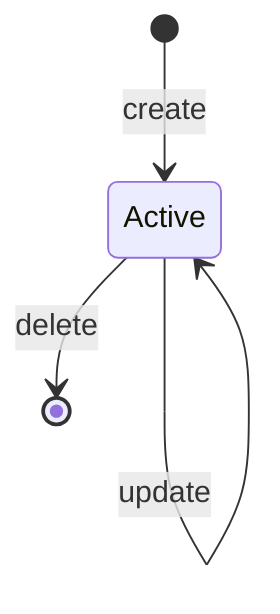
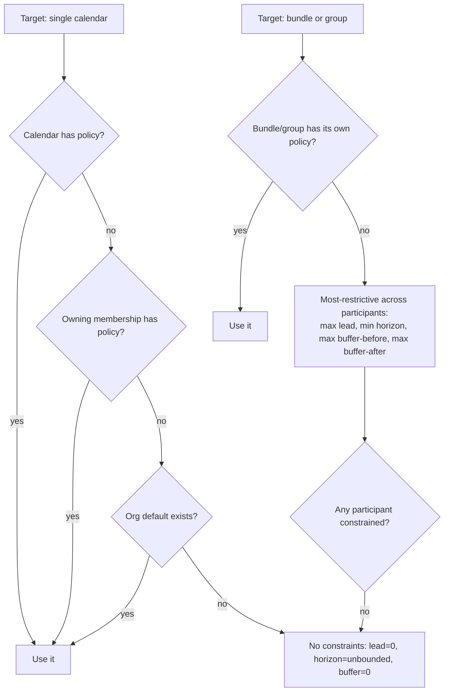

# Bookable Slots for Single Calendars & Bundles, with Booking Policies — Spec

## 1. Business Context

The platform already exposes discretized bookable time slots, but only for a *calendar group* — a structure that pools several calendars into role-based slots (e.g. "any physician" + "any room"). A partner who simply wants the open appointment times for **one** person's calendar, or for a **bundle** calendar (a calendar that aggregates several child calendars), has no direct way to ask for them. They either wrap a single calendar in a throwaway group, or pull the raw continuous availability windows and re-implement slot discretization themselves. Both are workarounds that every integrator re-invents.

Separately, the slot engine today offers *every* free slot in the search window. Real-world scheduling almost always needs guardrails:

- **Lead time** — you cannot book an appointment starting in five minutes; a provider needs minimum notice.
- **Max horizon** — you should not be able to book eighteen months out; calendars are only planned a season ahead.
- **Buffer between appointments** — a provider needs turnaround time (cleanup, notes, travel) so slots are not offered flush against an existing appointment.

None of these rules exist in the system. Integrators currently filter slots client-side, inconsistently, and the same un-guarded slots are reachable through the booking write path, so a client that forgets to filter can create a booking the business considers invalid.

**Who is affected.** External integration partners building scheduling UIs are the primary consumers (via the public GraphQL API). First-party frontends consuming the private REST surface are the secondary consumers. The product/scheduling team owns the booking-rule semantics. Support absorbs the fallout today when bad slots get booked.

**Cost of doing nothing (estimate).** Every integrator re-implements slot discretization and rule-filtering, so the same logic is duplicated and drifts; mis-bookings (too-soon, too-far, no-turnaround) land as support tickets and manual reschedules. No hard numbers were supplied; treat the cost as "recurring integration friction plus a steady trickle of mis-booking corrections."

This is one feature with two coupled halves: a **read surface** (slots for single calendars and bundles) and a **rules model** (BookingPolicy) that both the read surface and the booking write path must honor.

## 2. Hypothesis (to be validated)

Not a hypothesis — **known requirement**, driven by API completeness for integration partners and by the need to enforce booking guardrails consistently across discovery and booking. Validation is by definition-of-done (see **Objectives**), not by a metric soak.

## 3. Objectives (and definition of done)

1. **Single-calendar slot discovery.** A consumer can request bookable slots for any single calendar id and receive discretized slots where that calendar is free for the requested duration.
   - Signal: a query for a personal calendar returns the same slots the group-scoped query would return if that one calendar were the sole slot pool.
   - Done when: covered by automated tests for managed and unmanaged calendars, both the authenticated and the code-gated variants.

2. **Bundle slot discovery via the same surface.** Passing a bundle calendar id to the single-calendar query auto-expands the bundle; a slot is returned only when the bundle is bookable for the window.
   - Signal: a slot is offered only if every bundle child that participates in bookability is free for the window.
   - Done when: tests prove a busy child suppresses the slot, and a free bundle yields the expected slots.

3. **Booking policies honored on every slot surface.** Lead time, max horizon, and buffer-before/after are applied to the single-calendar query, the bundle query, and the existing group-scoped query.
   - Signal: with a policy set, slots inside the lead window, beyond the horizon, or within buffer of an existing event/blocked time are absent; with no policy anywhere, output is identical to today.
   - Done when: a regression test asserts byte-for-byte identical group-query output when no policy exists, and rule-application tests pass for each rule.

4. **Policy resolution order is deterministic.** For a single calendar: Calendar policy, then owning-membership policy, then org default. For bundles/groups: an explicit bundle/group policy overrides; otherwise the most-restrictive combination of participant policies applies.
   - Signal: resolution tests cover each layer present/absent and the most-restrictive fallback.
   - Done when: the resolution function is unit-tested across the full precedence matrix.

5. **Full CRUD for policies on both APIs.** A consumer can create, read, update, and delete a BookingPolicy through the public GraphQL API and the private REST API, scoped to their organization.
   - Signal: each operation has an authorized happy path and an unauthorized/forbidden path.
   - Done when: CRUD tests pass on both surfaces with organization-scope enforcement.

6. **Booking-time enforcement.** Creating a booking that violates the resolved policy is rejected with a useful error.
   - Signal: a booking inside lead time / beyond horizon / inside buffer is refused; a compliant booking succeeds.
   - Done when: enforcement tests pass on the booking write path for single, bundle, and group bookings.

## 4. Decisions

### 4.1 Use-cases

1. **Partner fetches slots for one provider.**
   - Actor: external integration partner (authenticated org token, or a booking code for an anonymous booking page).
   - Trigger: their scheduling UI needs open times for a single provider's calendar.
   - Flow:
     1. Consumer calls the unified bookable-slots query with the calendar id, a search window, a duration, and a slot step.
     2. The engine resolves the calendar's effective BookingPolicy (Calendar, then owning membership, then org default).
     3. The engine discretizes the window, drops candidates that fall inside lead time, beyond horizon, or within buffer of an existing event/blocked time.
     4. The consumer receives a list of bookable slot proposals.
   - Outcome: the UI renders only valid, policy-compliant slots for that provider.

2. **Partner fetches slots for a bundle.**
   - Actor: same as above.
   - Trigger: the bookable unit is a bundle (e.g. a service that occupies several child calendars at once).
   - Flow:
     1. Consumer calls the same query with the bundle calendar id.
     2. The engine detects the bundle type and expands the participating children.
     3. A candidate is bookable only when the bundle is free across the participating children for the window, after applying the bundle's effective policy.
     4. The consumer receives the bundle's bookable slots.
   - Outcome: the UI offers a slot only when the whole bundle can actually be booked.

3. **Scheduling admin configures a provider's rules.**
   - Actor: organization admin (authenticated, public GraphQL or private REST).
   - Trigger: a provider needs 24-hour lead time, a 60-day horizon, and 10-minute turnaround after each appointment.
   - Flow:
     1. Admin creates a BookingPolicy with the desired lead time, horizon, buffer-before, buffer-after.
     2. Admin attaches it to the provider's calendar (or membership, or the org default).
     3. Subsequent slot queries and booking attempts honor it immediately.
   - Outcome: the provider's slots and bookings reflect the new rules with no client-side filtering.

4. **Anonymous booking page (code-gated).**
   - Actor: an end user on a public scheduling link, no org token, holding a booking code.
   - Trigger: the page loads available times for the linked calendar or bundle.
   - Flow:
     1. The page calls the `_with_code` variant of the unified query with the booking code.
     2. The engine validates the code, resolves scope, applies the effective policy.
     3. The page renders compliant slots.
   - Outcome: external bookers see only valid slots without any privileged credential.

5. **Booking-time enforcement (integration-driven).**
   - Actor: any write path — partner integration, first-party frontend, or anonymous code-gated booking.
   - Trigger: a booking is submitted for a resolved calendar/bundle/group.
   - Flow:
     1. The booking request arrives with a target time and duration.
     2. The engine resolves the effective policy and checks lead time, horizon, and buffer against current calendar state.
     3. If any rule is violated, the booking is rejected with an explanatory error; otherwise it proceeds on the existing booking path.
   - Outcome: discovery and write agree — a slot the engine would not offer cannot be booked through a forgotten client-side check.

### 4.2 State transitions & edge cases

**BookingPolicy lifecycle.**

A BookingPolicy is a configuration record. It is Active once created, mutable in place, and removable. Deleting a policy means the resolver falls through to the next layer (or to "no constraints" if none remains). There is no draft/archived state.

**Effective-policy resolution.**

**Rule semantics.**
- **Lead time** and **max horizon** are measured *rolling from the request's "now"*. A candidate slot whose start is earlier than `now + lead_time`, or later than `now + max_horizon`, is dropped. (Optional absolute cutoff is out of scope — see **Negative scope**.)
- **Buffer** uses separate before and after durations, forming a dead zone **around each existing event**: a candidate slot `[start, end]` is dropped if it overlaps any existing CalendarEvent or BlockedTime expanded to `[event_start - buffer_before, event_end + buffer_after]`. (Worked example: an event 14:00–15:00 with buffer-before 10m / buffer-after 20m yields the dead zone 13:50–15:20 — see **Acceptance scenarios** #4. An earlier candidate-envelope phrasing here was inverted relative to scenario #4 and is corrected.)
- **No policy anywhere** = no constraints. Output is identical to current behavior. This is the backward-compatibility guarantee for the existing group query.

**Multi-calendar combination (bundle/group, no explicit override).** Effective rule = the strictest of each field across participants: `max(lead_time)`, `min(max_horizon)`, `max(buffer_before)`, `max(buffer_after)`. Rationale: never offer a slot any participant would reject.

**Edge cases.**
- *Empty search window or step ≥ window:* returns an empty slot list, not an error (consistent with today's positive-step validation).
- *Bundle with no participating children:* returns an empty list.
- *Calendar with no resolvable owning membership* (resource calendars, shared calendars): membership layer is skipped; resolution falls to org default, then no-constraints. (See **Open questions** on how ownership is resolved.)
- *Policy with buffer larger than the gap between two appointments:* the slot between them is simply never offered — expected.
- *Lead time that pushes the whole window into the past/future:* empty list, no error.
- *Negative or zero durations on policy fields:* rejected at write time with a validation error; zero is allowed (means "no constraint for that field").
- *Conflicting policies at the same layer* (e.g. both a calendar policy and a bundle override apply to a bundle booking): the most-specific target wins — an explicit bundle/group policy overrides per-calendar policies entirely for that bundle/group computation.

**Idempotency.**
- *Slot queries* are pure reads — naturally idempotent, no side effects.
- *Policy create:* creating a second policy for the same target is a **reject** ("policy already exists for this target") rather than a silent duplicate, so resolution stays unambiguous. Update is the path to change an existing one.
- *Policy update/delete:* idempotent — repeating yields the same final state (update to the same values is a no-op; deleting an absent policy is a no-op or a clear not-found, decided at plan time).

**Concurrency.**
- *Policy edits:* last-write-wins on the policy record; two admins editing the same policy is rare and low-stakes. No optimistic-lock surfacing required.
- *Booking-time enforcement:* the policy check is part of the existing booking transaction; it reads current calendar state at write time, so a slot that became invalid between discovery and booking is correctly rejected. This is the intended guard, not a race to avoid.

**Time-bounded behavior.** Lead time and horizon are themselves the time-bounded rules; they are evaluated against request time on every call, so no stored expiry or scheduled re-evaluation is needed. Slot results are not cached with respect to "now."

### 4.3 Acceptance scenarios

1. **Happy — single calendar.**
   Given a managed personal calendar with availability 09:00–17:00 and no policy,
   When a consumer queries bookable slots for a 30-minute duration at a 15-minute step over that day,
   Then the response lists every 15-minute-stepped 30-minute slot that fits inside 09:00–17:00.

2. **Happy — bundle expansion.**
   Given a bundle calendar with two participating children, both free 10:00–11:00,
   When a consumer queries bookable slots for a 60-minute duration,
   Then a 10:00–11:00 slot is returned; and given one child is busy 10:30–11:00, that slot is absent.

3. **Rule — lead time.**
   Given a calendar with a BookingPolicy of 24-hour lead time,
   When a consumer queries slots starting "now,"
   Then no slot beginning within the next 24 hours is returned, and the first eligible slot starts at or after now + 24h.

4. **Rule — buffer.**
   Given a calendar with an existing appointment 14:00–15:00 and a policy of buffer-before 10 min, buffer-after 20 min,
   When a consumer queries 30-minute slots,
   Then no slot overlaps 13:50–15:20, and the next slot after the appointment starts at or after 15:20.

5. **Backward compatibility — group query.**
   Given a calendar group and **no** BookingPolicy anywhere,
   When a consumer calls the existing group-scoped bookable-slots query,
   Then the result is identical to the pre-feature output.

6. **Error — invalid policy.**
   Given an admin submitting a BookingPolicy with a negative buffer,
   When the create mutation/endpoint runs,
   Then it is rejected with a validation error naming the offending field, and no policy is persisted.

7. **Integration — booking-time enforcement (code-gated).**
   Given an anonymous booker with a valid code and a calendar whose policy forbids bookings beyond a 60-day horizon,
   When they submit a booking 90 days out,
   Then the booking is rejected with a policy-violation error, and no event/blocked time is created.

### 4.4 Negative scope

- **No new booking creation mechanics.** Enforcement is added to the *existing* booking write path; we are not building a new reservation/hold/lock flow. Slot holds and double-booking prevention beyond the policy check stay as they are.
- **No absolute calendar-date cutoff for horizon.** Horizon is rolling-from-now only; a fixed end-date is deferred until a consumer actually needs it.
- **No recurring or time-windowed policies.** A policy is a flat set of values; "different lead time on weekends" or "seasonal horizon" is out of scope.
- **No per-service or per-appointment-type policies.** Policies attach to calendar / membership / bundle / group / org only, not to appointment types.
- **No REST changes to the slot read path.** Slot *discovery* stays GraphQL-only, matching the current surface; only **policy CRUD** gets a private REST surface (plus public GraphQL). The existing token-management REST endpoints are untouched.
- **No change to continuous availability/unavailability queries.** `availability_windows` / `unavailable_windows` and their `_with_code` variants keep their current contracts; policies apply to *slot* surfaces and the booking path, not to raw window queries.
- **No client-side migration tooling.** Integrators who already discretize windows themselves are not forced to migrate; the new query is additive.
- **No timezone redesign.** Existing timezone handling (IANA strings on availability/events) is reused as-is; we are not reworking how times are stored or converted.

## 5. Alternatives considered

- **Put lead/horizon/buffer fields directly on the Calendar (and on group/bundle).** Rejected: duplicates the same four fields across multiple models, gives no shared "org default," and makes "this provider's rules" mean "edit every one of their calendars." A dedicated policy object with a resolution chain keeps the rules in one shape and one place to reason about.
- **Generate slots in SQL (`generate_series`) per request.** Rejected for this feature: the existing Python slot walker already batches blocking data into a few queries and is correct; bolting policy math onto it is far simpler than moving the whole engine into SQL, and the performance ceiling has not been hit.
- **Keep slot discovery group-only and tell partners to wrap single calendars in groups.** Rejected: it is the status quo workaround the feature exists to remove; it leaks an internal modeling choice (groups) into every integrator's code.
- **Enforce policies only at booking time, not in discovery.** Rejected: discovery would keep offering slots that booking then rejects, which is exactly the bad-UX/mis-booking loop we are closing. Both surfaces must agree.

## 6. Open questions

1. **How is a calendar's "owning membership" resolved?** The membership→calendar link is assumed to run through an ownership relation rather than a direct FK. *Recommended default:* resolve the owning member via the existing calendar-ownership relation; if a calendar has zero or multiple owners, skip the membership layer and fall to org default. *Owner:* scheduling/calendar domain owner. *Unblocks:* confirming the exact ownership relation lets the plan write the resolver precisely.
2. **Which bundle children count toward bookability?** *Recommended default:* every child that participates in the bundle (all `bundle_children`) must be free for the window; the primary child does not get special treatment for availability. *Owner:* scheduling domain owner. *Unblocks:* confirms the bundle-expansion predicate and scenario 2's exact semantics.
3. **Where does the org-level default policy attach, and is there exactly one?** *Recommended default:* a single optional default policy per organization (one record), used as the final resolution layer. *Owner:* product. *Unblocks:* settles the bottom of the resolution chain and the create-uniqueness rule.
4. **Does deleting an absent policy return not-found or succeed as a no-op?** *Recommended default:* idempotent no-op success, to keep clients simple. *Owner:* API owner. *Unblocks:* finalizes the delete contract on both APIs.
5. **Should the `_with_code` slot variant expose policy details, or only the filtered slots?** *Recommended default:* return only the resulting slots (anonymous bookers don't need to see the rule values). *Owner:* product/security. *Unblocks:* fixes the code-gated response shape.

## 7. Risks assumed

- **Changing the existing group query's output once policies exist.** The group-scoped slot query is already public; enabling policy-awareness changes what it returns for any org that sets a policy. *Assumption:* integrators treat "fewer/filtered slots" as a correctness improvement, not a breaking change. *Mitigation:* guarantee byte-for-byte identical output when no policy exists (acceptance scenario 5); announce the behavior change to partners before any org enables policies. *Likelihood/severity:* medium / medium.
- **Resolution chain depends on an ownership relation that may be fuzzy.** If a calendar has no clean single owning membership, the "membership" layer silently no-ops. *Assumption:* most personal calendars have exactly one owner; resource/bundle calendars legitimately skip the membership layer. *Mitigation:* explicit org-default fallback; document the skip; resolve **Open questions** item 1 before implementation. *Likelihood/severity:* medium / medium.
- **Buffer/lead/horizon math on the per-candidate walk adds cost.** Each candidate now also does envelope-overlap checks against events and blocked times. *Assumption:* the existing batched-fetch + Python-walk approach absorbs the extra per-candidate work within current performance bounds. *Mitigation:* reuse the already-fetched blocking spans for buffer checks; if a hot tenant regresses, revisit the SQL-generation alternative. *Likelihood/severity:* low / medium.
- **Discovery/booking divergence under concurrency.** A slot valid at discovery can become invalid before booking. *Assumption:* booking-time enforcement reading current state at write time is the correct and sufficient guard. *Mitigation:* enforce inside the existing booking transaction; accepted that discovery is best-effort and booking is authoritative — no further mitigation. *Likelihood/severity:* low / low.
- **Most-restrictive combination surprises bundle/group owners.** A single strict participant can collapse a bundle's offered slots. *Assumption:* "never offer a slot a participant would reject" is the desired safe default, and the bundle/group-level override exists precisely for owners who want different behavior. *Mitigation:* document the rule; expose the override. *Likelihood/severity:* low / low.
