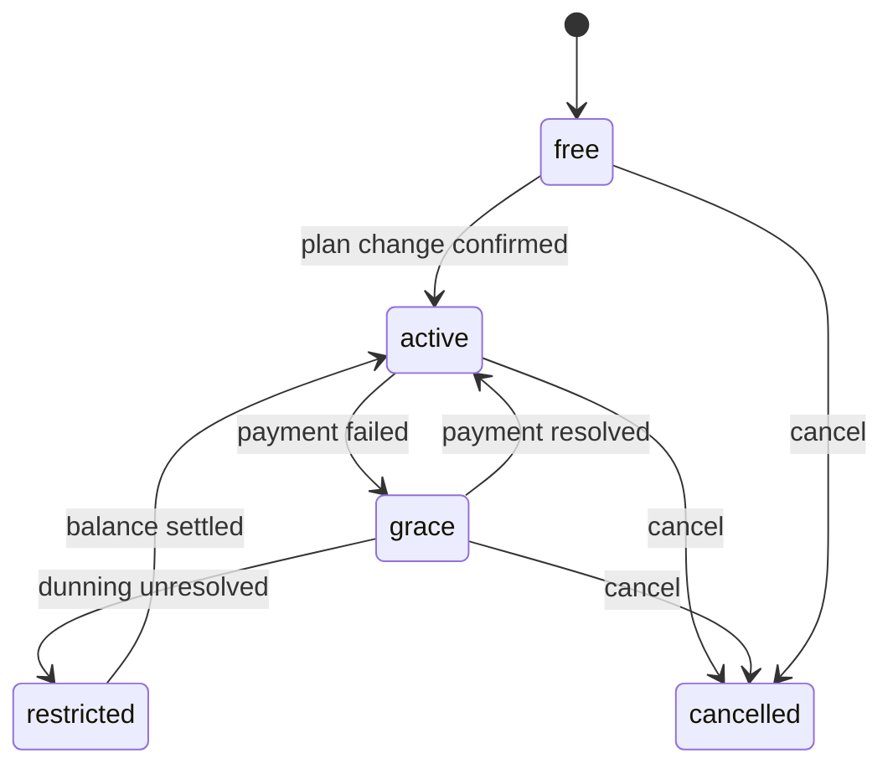
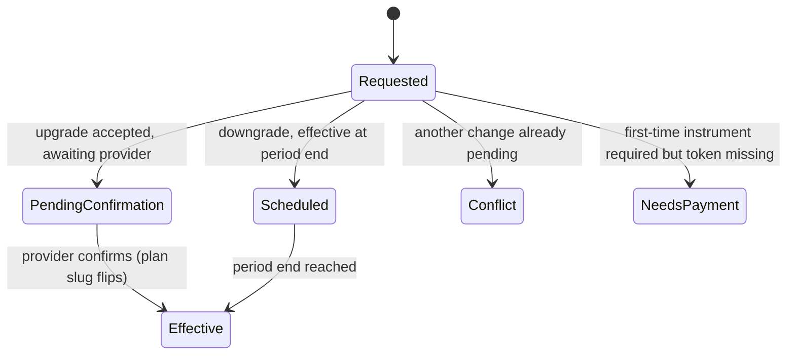
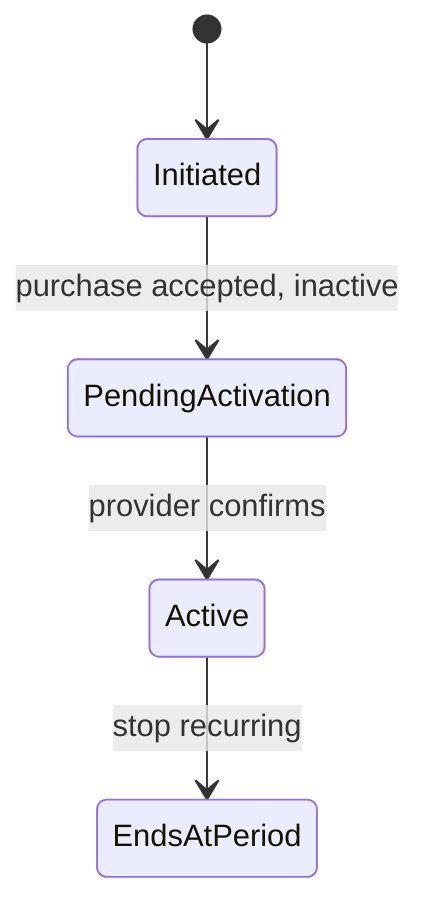

# Billing Plans and Limits (Frontend) — Spec

## 1. Business Context

The backend shipped a complete billing surface — plan catalog, subscription, plan changes, capacity add-ons, usage metering, and plan-derived limit enforcement across resource creation. It is live but inert on limits: every organization is seeded on an "unlimited" plan whose ceilings are all null, so the enforcement code runs but blocks nobody. Real plans with real ceilings, and the failed-payment "restricted" state, are a separate future rollout.

The web app has **no billing surface today**. There is no billing-profile screen, no plan picker, no usage view, and no handling for the new "payment required" rejection. So nothing in the current app is broken by the contract change right now — there is no code correlating the old identifiers, and no non-admin write path to reject. The work is therefore **net-new**, and the requirement is to build that surface adopting the new contract correctly from day one, so that when real plans and ceilings roll out the app already behaves correctly with zero further changes.

Who cares this lands:
- **Organization admins / billing owners** — the people who will pick a plan, add capacity, and settle balances. Today they cannot self-serve any of this in the app.
- **All members** — anyone who creates a resource (invites a teammate, adds a calendar, schedules an event) can hit a capacity ceiling once real plans exist; they need to understand what happened and where to go.
- **Product / growth** — self-serve upgrade and add-on purchase is the paid-conversion path.
- **Partner integrations** — token-authenticated event creation can hit the same ceilings; out of scope for this frontend feature, but the shared error contract is the same.

Cost of doing nothing: when real plans roll out, resource-creation flows would fail with an error the app has never seen and cannot explain, leaving users stuck with no route to resolve it; and there would be no way to view a plan, buy capacity, or settle an outstanding balance from the product at all.

This is a **known requirement**, not a hypothesis — the backend contract is fixed and live, and the app must conform to it.

## 2. Hypothesis (to be validated)

Not a hypothesis — known requirement driven by a live, fixed backend contract plus an upcoming plan rollout the app must be ready for. Correctness and completeness against the contract matter; there is no metric to validate or roll back against.

## 3. Objectives (and definition of done)

1. **Billing profile is manageable in-app under the new ownership model.**
   - Signal: an admin can create and edit the organization's billing profile, including the now-required contact name and email; a non-admin who attempts a write gets a clear, non-broken message instead of a raw failure.
   - Source: the billing-profile screens and their tests.
   - Done when: create / edit work for admins against the active organization; the profile is keyed by organization; a rejected non-admin write is handled gracefully.

2. **Every guarded write path surfaces the "limit exceeded" rejection gracefully and routes the user to the right remedy.**
   - Signal: each guarded create/mutation, when it receives the rejection, shows a clear message and routes to the matching remedy (buy add-on, upgrade plan, add a card, or settle balance).
   - Source: a shared error-handling path plus tests that simulate the rejection body on each guarded operation.
   - Done when: the rejection is parsed into a typed error and routed by remedy on all guarded operations — verified by tests even though it cannot fire in production yet.

3. **Admins can self-serve the full billing lifecycle.**
   - Signal: an admin can view available plans and the current subscription, change plan (upgrade or downgrade), cancel, view usage, and purchase / stop an add-on, including first-time card capture.
   - Source: the billing area and its tests.
   - Done when: all of the above complete end to end, with pending/asynchronous states reflected until the provider confirms.

4. **No regressions for multi-organization and non-admin users.**
   - Signal: users belonging to more than one organization, and non-admin members, continue to use the app normally; billing requests carry the active-organization context and resolve the correct organization.
   - Source: regression tests across multi-org and role scenarios.
   - Done when: the existing active-organization and role behavior is preserved and the billing screens honor it.

**Overall definition of done:** no regressions for multi-org / non-admin users, and every guarded write path surfaces the rejection gracefully — all verified by tests — even though the rejection cannot fire in production until the future plan rollout.

## 4. Decisions

### 4.1 Use-cases

1. **Admin creates the billing profile.**
   - Actor: an organization admin.
   - Trigger: opens the billing profile screen for an organization that has none.
   - Flow:
     1. Sees an empty profile form requiring a contact first name and contact email, with optional last name, phone, document type/number, and billing address.
     2. Fills the required fields and submits.
     3. The request carries the active-organization context.
     4. The profile is created and shown, keyed to the organization.
   - Outcome: the organization has exactly one billing profile; a second create attempt is reported as "already exists" rather than creating a duplicate.

2. **Non-admin member tries to edit the billing profile.**
   - Actor: a member who is not an admin.
   - Trigger: opens the billing profile screen and attempts to save an edit.
   - Flow:
     1. Can view the profile.
     2. Submits a change.
     3. The write is rejected because writes are admin-only.
     4. The app shows a clear "only organization admins can edit billing" message and leaves the form unchanged.
   - Outcome: no data changes; the member understands why and who can do it.

3. **Member hits a capacity ceiling while creating a resource.**
   - Actor: any member.
   - Trigger: performs a guarded create (for example, invites a teammate, creates a calendar, schedules an event) when the organization is at its ceiling for that resource.
   - Flow:
     1. Submits the create.
     2. The operation is rejected with the "limit exceeded" contract, naming the resource and a remedy.
     3. The app rolls the UI back to the pre-submit state (nothing was persisted server-side) and shows a message built from the rejection.
     4. The app routes the user to the remedy: buy more capacity, upgrade the plan, add a card, or settle the balance.
   - Outcome: the user is not left with a silent or cryptic failure; they land on the action that unblocks them.

3a. **A note on "today":** because every organization is currently on an unlimited plan, this rejection cannot occur in production yet. The handling is built and tested now so the future rollout requires no client change.

4. **Admin views plans and changes plan.**
   - Actor: an admin / billing owner.
   - Trigger: opens the plan picker.
   - Flow:
     1. Sees the active plans available for the organization's currency, with a monthly / annual toggle where an annual price exists, and each plan's limits and feature entitlements.
     2. Picks a target plan and interval and confirms.
     3. If this is the first time the organization attaches a payment instrument, the app captures card details through the provider and obtains a payment token to include; otherwise it omits the token.
     4. The app sends the change with a fresh idempotency key.
     5. For an upgrade, capacity is not granted synchronously — the app shows a pending state and polls the subscription until the plan takes effect. For a downgrade, the app shows that the change is scheduled to take effect at period end.
   - Outcome: the subscription reflects the requested change (immediately for a scheduled downgrade marker; after provider confirmation for an upgrade).

5. **Admin purchases a capacity add-on.**
   - Actor: an admin / billing owner.
   - Trigger: opens the add-on purchase flow (directly, or routed there by a "buy more capacity" remedy).
   - Flow:
     1. Chooses a resource and quantity for a resource the current plan sells overage on.
     2. Confirms; the app captures card details if no instrument is on file, and sends the purchase with a fresh idempotency key.
     3. The add-on is returned inactive; the app shows it as pending activation and polls until it activates.
   - Outcome: once the provider confirms, the add-on is active and the organization's effective ceiling for that resource increases.

6. **Any member views usage.**
   - Actor: any member.
   - Trigger: opens the usage view.
   - Flow:
     1. Sees one meter per limited resource with current usage against the effective ceiling.
     2. A resource with no ceiling is shown as unlimited (∞), never as a full bar.
   - Outcome: the member understands current consumption. This view stays readable even when the organization is restricted.

7. **Admin settles a restricted organization.**
   - Actor: an admin / billing owner of a restricted organization.
   - Trigger: sees the restricted banner and follows it, or is routed there by a "settle balance" remedy.
   - Flow:
     1. Sees that writes are blocked pending payment and that reads / exports still work.
     2. Follows the settle-balance path to resolve the outstanding balance.
   - Outcome: once resolved server-side, the organization leaves the restricted state and writes resume.

8. **Admin cancels the subscription.**
   - Actor: an admin / billing owner.
   - Trigger: chooses to cancel.
   - Flow:
     1. Confirms the cancellation.
     2. The subscription transitions toward cancelled.
   - Outcome: the subscription reflects the cancellation.

### 4.2 State transitions & edge cases

**Billing state (drives global banners and the restricted behavior):**

- **free / active** — normal; no banner blocking, full functionality.
- **grace** — a payment failed but nothing is blocked yet; the app shows an informational banner but does not block writes.
- **restricted** — writes are blocked with the "limit exceeded" contract carrying the restricted-state marker and the settle-balance remedy; reads, exports, and the entire billing area stay open; the app shows a prominent restricted banner routing to settle balance.
- **cancelled** — surfaced in the subscription view.

**Plan-change lifecycle (as the app observes it):**

- **PendingConfirmation** — the app shows a pending state and polls the subscription until the plan takes effect; it does not assume the upgrade is effective on the accepted response.
- **Scheduled** — the app shows the pending plan and its effective date.
- **Conflict** — a different change is already awaiting confirmation; the app tells the user to wait for it to settle and does not send a competing change.
- **NeedsPayment** — the app captures a card and retries with a token.

**Add-on lifecycle:**

- A purchased add-on is returned inactive; the app shows "pending activation" and polls until active.
- Stopping a recurring add-on marks it to not renew at period end; existing capacity holds until then.

**Edge cases and decided handling:**

- **Multi-organization caller** — the active-organization context is required for callers with two or more memberships; the app already resolves and sends this on every request. Billing screens honor the active organization and re-fetch on switch.
- **Wrong / non-member organization context** — resolved by the app's existing organization-error recovery (re-pick and retry).
- **Billing profile keyed by organization** — the profile identifier now identifies the organization, not a user; the app treats one profile per organization and never correlates the identifier to a user. A second create is reported as a conflict.
- **Required contact fields missing** — a create/edit omitting the required contact name or email is rejected; the form validates these before submit and surfaces server rejections field-by-field.
- **Non-admin write** — rejected; shown as an admin-only message, form left intact.
- **Unlimited / not-included limits** — a null ceiling is "unlimited" (∞); a zero ceiling is "not included"; these are visually distinct and never rendered as a full bar at zero. Today every ceiling is null.
- **Restricted reads** — usage and every billing screen remain readable while restricted.
- **No subscription** — the subscription and usage screens handle "this organization has no subscription" without erroring the app.
- **Add-on not sellable** — purchasing a resource the current plan does not sell overage on is rejected; the app surfaces this on the field rather than failing opaquely.
- **Reseller / child organization** — reads resolve against the organization's billing root (a child sees the pooled, parent-level subscription and usage); the app displays these read values but offers no reseller management UI (see Negative scope).
- **Provider variance** — the subscription names its payment provider; the card-capture layer is provider-agnostic so the correct provider path is used.

**Idempotency:** plan changes and add-on purchases are idempotent on a client-generated key. The app generates one key per distinct user intent and reuses that same key on any retry (network error, double submit), so a retried change never double-applies. A fresh user action always uses a fresh key.

**Concurrency:** a plan change while another is already awaiting confirmation is a conflict; the app surfaces "a change is already pending" and does not issue a competing change. Billing-profile edits use last-write-wins at the field level as the server allows; the admin-only gate is the primary guard.

**Time-bounded behavior:** downgrades take effect at the end of the current billing period (the app shows the effective date, does not apply it early). Upgrades and add-ons resolve asynchronously on provider confirmation; the app polls until the observable state changes rather than assuming immediate effect. The app does not itself run timers for grace/restriction — it reflects the state the server reports.

### 4.3 Acceptance scenarios

1. **Happy — admin creates a billing profile.**
   Given an admin viewing an organization with no billing profile, when they submit the form with a contact first name and contact email, then the profile is created, shown, and keyed to the organization, and a subsequent create attempt is reported as already existing rather than duplicated.

2. **Error — non-admin edit is rejected cleanly.**
   Given a non-admin member on the billing profile screen, when they submit an edit, then the write is rejected and the app shows an "only organization admins can edit billing" message with the form unchanged and no data written.

3. **Error — required contact fields.**
   Given an admin editing the billing profile, when they submit without a contact email, then the app blocks the submit and shows the missing-field error, and any server-side rejection of a required field is surfaced on that field.

4. **Edge — limit-exceeded routes by remedy.**
   Given a guarded create that returns the "limit exceeded" contract with a given remedy, when the app receives it, then the pre-submit UI is restored (nothing persisted), a message built from the rejection is shown, and the user is routed to the matching remedy — buy add-on, upgrade plan, add a card, or settle balance — for each of the four remedies.

5. **Edge — usage shows unlimited correctly.**
   Given a usage response where a resource has no ceiling, when the usage view renders, then that resource shows as unlimited (∞) and never as a full bar at zero; and a resource with a positive ceiling shows current usage against it.

6. **Integration/async — upgrade pends until provider confirms.**
   Given an admin who confirms an upgrade, when the change is accepted, then the app shows a pending state and polls the subscription, and only reflects the new plan after the plan takes effect; and if a change is already pending, a second attempt is refused with "a change is already pending."

7. **Async — add-on activates after confirmation.**
   Given an admin who purchases an add-on, when the purchase is accepted and returned inactive, then the app shows it as pending activation and polls until it activates, at which point the effective ceiling reflects the added capacity.

8. **Restricted — writes blocked, reads open.**
   Given an organization in the restricted state, when a member opens the app, then a restricted banner routes to settle balance, guarded writes are rejected and routed to the settle-balance remedy, and usage / billing screens and exports remain readable.

### 4.4 Negative scope

- **Reseller / child-organization billing management** — no UI to manage a parent's billing from a child, and no reseller-root acting-as flow. Read values that resolve to the billing root are displayed, but management is out. Reason: distinct permission model and audience; not needed for the initial surface.
- **Dunning / grace email flows** — the frontend plays no part in failed-payment email sequences; only the in-app grace/restricted banner. Reason: server/notification concern.
- **GraphQL error handling** — the app has no GraphQL data layer; the guarded operations exist here as REST calls, so only the REST rejection needs handling. Reason: the GraphQL variant of the contract has no consumer in this app.
- **Active-organization plumbing and the header/role primitives** — already built; this feature consumes them, it does not rebuild them. Reason: existing, mature infrastructure.
- **Partner/token-authenticated event creation flows** — the same ceilings apply server-side, but those are not user-facing screens in this app. Reason: not a UI surface here.
- **Provider webhook handling** — inbound provider callbacks are a backend concern; the app only observes their effect by polling. Reason: not a client responsibility.
- **Stripe as a live path** — the provider-agnostic layer includes a Stripe implementation, but Stripe is not routed to any organization, so it cannot be exercised end to end in this feature; MercadoPago is the only verifiable path. Reason: backend has not routed Stripe yet.

## 5. Alternatives considered

- **Adapt only the breaking changes now, defer the self-serve surface.** Rejected by the requester in favor of building the full surface (profile, plans, subscription, add-ons, usage, payment capture, remedy routing) in one feature so the future plan rollout is a client no-op.
- **Generic "limit exceeded" message with a single "manage billing" link, remedy routing later.** Rejected in favor of full remedy-specific routing now, so each rejection lands the user on the exact unblocking action.
- **MercadoPago-only card capture.** Rejected in favor of a provider-agnostic abstraction implementing both providers, so a future Stripe rollout needs no client change — accepting that the Stripe path cannot be verified live yet (see Risks assumed).
- **Admin-only billing area hidden from members.** Rejected in favor of showing billing to all members and handling the admin-only write rejection gracefully, so members can at least view plans and usage.

## 6. Open questions

1. **Where does the client get the provider publishable key?** The handoff documents no endpoint that serves the client-side publishable key needed for card tokenization; the decision is that the backend provides it at runtime, but the exact source is unspecified.
   - Recommended default: fetch it from a backend-provided value at runtime (for example, on the subscription/provider response) rather than a build-time config; block only the card-capture path on it, not the read-only billing screens.
   - Who can answer: the billing backend owner.
   - Unblocks: the payment-capture work; until resolved, the read-only surface and remedy routing (minus the card-capture step) can proceed.

2. **Which resource-creation flows in this app are actually reachable by users and must carry remedy routing?** The contract lists guarded operations; the app implements a subset as user-facing flows (team invites, resource calendars, calendar groups, calendar bundles, availability windows, webhook subscriptions, system users/tokens, event/booking creation). The exact final list of screens to wire should be confirmed against the current app during planning.
   - Recommended default: wire the shared handler globally so any guarded write is covered, and additionally add remedy routing on the known user-facing creation flows.
   - Who can answer: the implementing team during planning.
   - Unblocks: the coverage checklist for objective 2.

3. **Do invoice/receipt history and editing the saved payment method ship in this feature or a fast-follow?** These were left in scope but not detailed in the interview, and the handoff exposes no invoice/receipt or payment-method-management endpoints.
   - Recommended default: keep them in scope only if backend endpoints exist; if not, split them into a fast-follow and note the dependency. Confirm endpoint availability before committing.
   - Who can answer: the billing backend owner + the requester.
   - Unblocks: final scope of the billing area.

4. **What is the exact settle-balance action for a restricted organization?** The remedy routes to "settle outstanding balance," but the concrete action (re-attempt payment, update card, pay an invoice) is not specified by the handoff.
   - Recommended default: route to the card-capture / retry-payment path and re-poll billing state; refine once the backend action is confirmed.
   - Who can answer: the billing backend owner.
   - Unblocks: the restricted-state resolution flow.

## 7. Risks assumed

- **Stripe path is unverifiable now.** Assumption: building a provider-agnostic card-capture layer including Stripe will match the real Stripe integration when it is later routed. If the assumption is violated, the Stripe path ships untested and may need rework at rollout. Mitigation: implement against the documented provider abstraction, keep the Stripe path behind the same interface as MercadoPago, and treat it as unverified until a real org is routed. Likelihood: medium. Severity: medium.

- **Remedy routing is built against an inert contract.** Assumption: the rejection body shape (resource, remedy, usage, ceiling) is stable and matches production behavior at rollout. If it drifts before real plans ship, routing may mismatch. Mitigation: parse defensively, branch on the machine-readable remedy rather than message text, cover every remedy with tests, and treat unknown remedies as a safe generic fallback. Likelihood: low. Severity: medium.

- **Restricted-state coverage exceeds the documented responses.** Assumption: some restricted-state write blocks are emitted at runtime even where the spec does not list the rejection among an operation's documented responses. If the app only handles documented cases, it will miss real rejections. Mitigation: handle the rejection defensively on all guarded writes regardless of the documented response list, via the shared global handler. Likelihood: medium. Severity: low.

- **Publishable-key sourcing blocks payment capture.** Assumption: the backend can serve the provider publishable key at runtime before the payment-capture work lands. If it cannot, card capture is blocked. Mitigation: sequence read-only screens and remedy routing (minus card capture) first; keep card capture behind the resolved key source. Likelihood: medium. Severity: medium. See Open questions.

- **Async confirmation via polling may lag or hang.** Assumption: the provider confirms within a reasonable window and the subscription/usage reflect it, so polling terminates. If confirmation is slow or never arrives, the pending state could persist. Mitigation: bound the polling with a clear "still processing — check back" terminal state rather than spinning indefinitely, and let the user re-open to re-check. Likelihood: low. Severity: low.

- **Scope breadth in one feature.** Assumption: profile + plans + subscription + add-ons + usage + payment capture + full remedy routing can land as one coherent feature without the correctness bar slipping. If breadth outruns the "no regressions + contract coverage" bar, quality is at risk. Mitigation: phase the plan so the read-only and adaptation work (which must be correct-from-day-one) lands and is tested before the transactional/payment work; gate on the test coverage in the objectives. Likelihood: medium. Severity: medium.

- **Accepted, no mitigation:** because limits are inert in production today, none of the limit-enforcement or restricted-state handling can be validated against real production behavior in this feature — only against simulated contracts in tests. This is accepted; the future plan rollout is the first real exercise. See Open questions for the coverage checklist that stands in for production validation.
