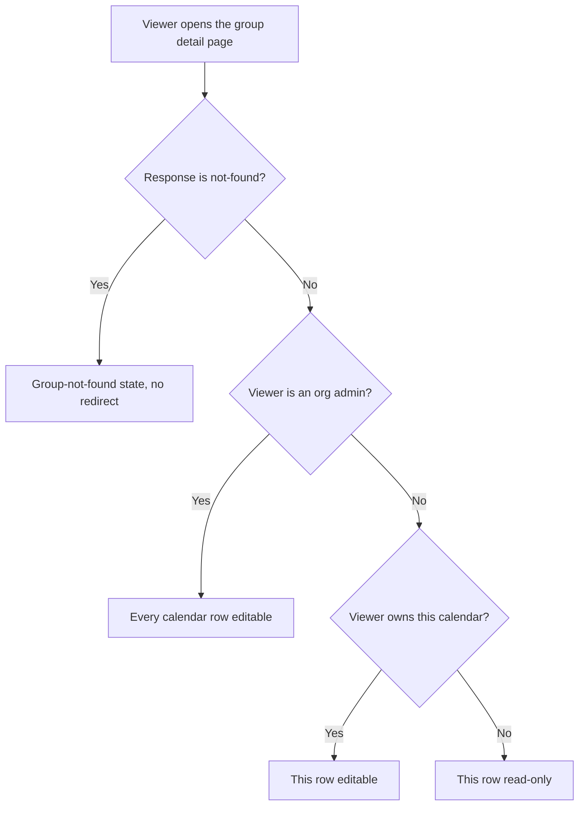
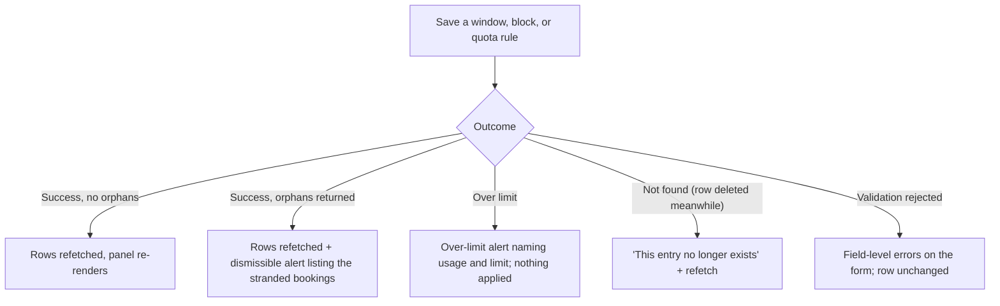

# Calendar Group-Scoped Availability (Web) — Spec

## 1. Business Context

A calendar group aggregates calendars into named slots so one booking can pick a calendar from each slot and guarantee everyone picked is free at the same time. Until now, availability lived in exactly one place: on the calendar itself. A surgeon available Monday to Friday is offered Monday to Friday in every group they belong to, whether the group books consults or operations.

The backend has removed that limitation. A calendar can now be narrowed inside one group — through group-scoped availability windows that intersect its base availability, group-scoped blocked time that removes time within that group only, and quota rules that cap how many bookings the calendar takes through that group per day, week, or month. None of it affects any other group, and none of it can make a calendar bookable at a time its base availability excludes.

The web app has no surface for any of it. Today the calendar groups list shows name, description, and slot count, and can create a group; there is no per-group page, no way to see a slot's roster, and no way to configure anything about a calendar's participation in a group. The three concepts are reachable only by calling the API directly or through the public API with a partner token. Organizations that need role-specific rosters — the clinical, legal, and professional-services scheduling this product targets — cannot configure one without engineering help.

The cost of doing nothing is entirely prospective: there are no customers yet, so nothing is broken for anyone today. What it costs is that a capability the backend has already shipped is unreachable to the people it was built for, and the workaround it exists to kill — splitting one person into several resource calendars, which silently double-books the human — remains the only path available in the product.

Stakeholders: organization admins and schedulers who configure rosters, the org members whose own time is being scheduled and who are expected to cap or block their own load, and the backend team whose branch this depends on.

## 2. Hypothesis (to be validated)

Not a hypothesis — **known requirement**, driven by a backend capability that has no client. There is no validation gate and no kill criterion. Correctness, scope discipline, and not disturbing existing behavior are what matter. There is no hard deadline.

## 3. Objectives (and definition of done)

1. **All three concepts are manageable end to end from the web app.**
   - Signal: an admin can list, create, edit, and delete availability windows, blocked times, and quota rules for any calendar in any slot of any group in their organization, without leaving the product.
   - Source: acceptance scenarios, exercised end to end.
   - Threshold: three concepts, four operations each, no concept reachable only through the API.

2. **A calendar's owner can configure their own participation, and only their own.**
   - Signal: a member reaches the groups their calendars belong to, opens one, and edits their own calendar's configuration; every other calendar in that group renders read-only for them.
   - Source: acceptance scenarios covering the member path.
   - Threshold: binary — a member can never reach a write control for a calendar they do not own.

3. **Nothing the API holds is invisible or silently destroyed.**
   - Signal: every row the API returns for a slot is represented in the panel — either in an editor that can change it, or in a read-only list that names it and can delete it. Saving an editor never rewrites or drops a row the editor could not represent.
   - Source: acceptance scenario covering configuration authored outside the web app.
   - Threshold: zero rows unaccounted for.

4. **Every documented failure mode has a specific, handled state.**
   - Signal: the orphaned-bookings list, the plan-limit rejection, the not-found response, and a write against a row someone else deleted each render a state written for that case, not a generic failure.
   - Source: acceptance scenarios, one per failure mode.
   - Threshold: four named states, none falling through to an unhandled error.

5. **Non-disclosure is preserved in the interface.**
   - Signal: no copy, empty state, or interaction distinguishes "this group does not exist" from "this group belongs to another organization" from "you are not allowed to see this group".
   - Source: review of every state reachable from a not-found response.
   - Threshold: identical treatment in all cases.

6. **Existing surfaces are untouched.**
   - Signal: the availability page and its tabs, the group booking flow, the calendar and event views, and the colleague availability view behave exactly as before.
   - Source: the existing test suites for those surfaces, unchanged and passing.
   - Threshold: no assertion in those suites needs editing to accommodate this work.

Definition of done: objectives 1 through 6 all hold, verified by the acceptance scenarios below.

## 4. Decisions

### 4.1 Use-cases

**UC-1 — Admin narrows a surgeon to operating days**
- Actor: organization admin.
- Trigger: setting up the Surgery group's roster.
- Flow:
  1. Admin opens the Surgery group from the calendar groups list, landing on its detail page.
  2. The page lists the group's slots; under "Lead Surgeon" they open Dr. Reyes' row.
  3. In the availability windows editor — a weekday grid, the same shape as the base availability editor — they tick Tuesday and Thursday and set both to 9am–5pm, leaving the timezone at the clinic calendar's own.
  4. They save.
- Outcome: the Surgery group offers Dr. Reyes only on Tuesdays and Thursdays. Dr. Reyes' base availability and every other group they belong to are unchanged, and the panel reflects the saved rows without a page reload.

**UC-2 — Member caps their own weekly load**
- Actor: Dr. Reyes, who owns their calendar.
- Trigger: they are being over-booked for operations.
- Flow:
  1. Dr. Reyes opens the calendar groups list, which shows them the groups containing a calendar they own.
  2. They open the Surgery group and find their own row under "Lead Surgeon" — the only row on the page with editable controls.
  3. In the quota section they add a rule: period "week", cap 3. Helper text on the period field states that week boundaries are measured in UTC.
  4. They save.
- Outcome: the rule is saved and listed. Once three operations are booked in a given week, the backend stops offering Dr. Reyes for that week in the Surgery group.

**UC-3 — Member blocks one week for one activity**
- Actor: Dr. Reyes.
- Trigger: a conference next Tuesday and Thursday, during which they will still take remote consults.
- Flow:
  1. On the same page, Dr. Reyes opens the blocked times section — a list of rows, added through a form with date, start and end time, timezone, an optional reason, and an optional repeat sub-form.
  2. They add two one-off blocks with the reason "Conference" and save each.
  3. Each save returns and the list re-renders with the new rows.
- Outcome: the Surgery group offers nothing for Dr. Reyes on those two days. No base availability was changed and no global block was created, so the Consults group is unaffected.

**UC-4 — Admin opens a calendar an integration configured**
- Actor: organization admin.
- Trigger: a rostering system has pushed windows for this slot through the public API, including a pattern the weekday grid cannot express.
- Flow:
  1. Admin opens the calendar's row.
  2. The weekday grid renders the weekly rows it can express.
  3. Beneath it, a read-only list names every other window — one-offs and non-weekly recurrences — each with a delete action and an explanation that it cannot be edited here.
  4. Admin edits the grid and saves.
- Outcome: only the weekly rows the grid represents are written. The read-only rows are left exactly as the integration wrote them, and the admin can see they exist rather than discovering their effect later through discovery results that do not match the grid.

**UC-5 — Admin tightens a window that orphans bookings**
- Actor: organization admin.
- Trigger: Dr. Reyes drops Tuesdays.
- Flow:
  1. Admin unticks Tuesday in the grid and saves.
  2. The save succeeds and the write response carries a list of confirmed future bookings in this group that no longer fit.
  3. A dismissible alert appears in the panel listing each one — title, time, calendar — with a link to the booking, and states plainly that nothing was cancelled.
  4. Admin follows the links and cancels or reschedules each by hand.
- Outcome: the narrowing is applied, the admin knows exactly what it stranded, and no booking was changed on their behalf.

**UC-6 — Admin hits the plan limit**
- Actor: organization admin.
- Trigger: adding another window for an organization already at its availability window limit.
- Flow:
  1. Admin saves the grid.
  2. The write is rejected as over-limit.
  3. A dedicated alert states that the organization is at its limit for availability windows and names the current usage and the limit from the rejection body. It does not link to an upgrade flow, because the product has no billing surface.
  4. The panel re-renders the rows as they were before the attempt.
- Outcome: the admin understands why the save failed and that nothing was partially applied.

**UC-7 — Admin checks the effect before trusting it**
- Actor: organization admin.
- Trigger: they configured a Saturday window and want to know whether it does anything.
- Flow:
  1. On the calendar's row, the admin opens the preview strip and picks a date range, defaulting to the coming seven days.
  2. The strip queries the group's availability over that range and shows, per day, whether this calendar comes back free for the group.
  3. Saturday shows nothing, because base availability excludes it.
- Outcome: the intersect-only rule is visible rather than inferred, without the admin having to open the booking dialog and simulate a booking.

**UC-8 — Someone opens a group they cannot see**
- Actor: any signed-in user.
- Trigger: a pasted or stale link to a group that does not exist, belongs to another organization, or that they are not allowed to see.
- Flow:
  1. They open the group detail page.
  2. The request comes back not-found — identically in all three cases, by the API's design.
  3. The page renders a "group not found" state with a way back to the calendar groups list. The URL is not changed and no redirect fires.
- Outcome: the user is unstuck, and nothing in the interface reveals which of the three situations they are in.

### 4.2 State transitions & edge cases

There is no lifecycle state machine — windows, blocks, and quota rules exist or they do not. What matters is who may edit what, and what a save can come back as.

**Who may edit what, on the group detail page:**

**What a save can come back as:**

**Edge cases and their decided handling:**

| Edge case | Handling |
| --- | --- |
| Calendar has no group-scoped configuration | The row shows empty editors and a plain "not configured" summary. Nothing is written until the author acts. |
| Window or block the weekday grid cannot express | Listed read-only beneath the grid, named, deletable, never rewritten by a grid save. |
| Every window for a calendar is unrepresentable in the grid | The grid renders empty and the read-only list carries all of them. The grid stays usable — a new weekly window can still be added alongside. |
| Grid saved with nothing changed | No writes are issued. The panel diffs current rows against the editor's state and sends only genuine creates, updates, and deletes. |
| Submit pressed twice, or a double-click | Controls disable while a write is in flight, as existing forms in the product do. No duplicate row is created. |
| Deleting a recurring window or block | Confirmed first, with copy stating the whole series is removed, since the API deletes the series rather than one occurrence. |
| Save orphans confirmed future bookings | Save succeeds; a dismissible alert lists them; nothing is cancelled, rescheduled, or notified. |
| Save rejected as over-limit | Dedicated alert; the editor keeps the author's input so they can undo part of it and retry. |
| Write returns not-found because another actor deleted the row | Treated as "this entry no longer exists", the rows refetch, and the panel re-renders in the state the other actor left. |
| Two admins editing the same slot | Last-write-wins, as the API defines. No locking, no conflict prompt, no live subscription. Each successful write refetches so the panel converges on the server's state. |
| A quota period already has a rule for this calendar and slot | The API rejects it; the message is surfaced on the form. A calendar may hold one rule per period, so daily and weekly rules can coexist. |
| Group booking rejected because a calendar violates a group-scoped rule | Handled by the existing race-condition path: the booking flow re-checks availability and re-renders. The rejection's rule-type token is not parsed, and no new copy is written for it. |
| Quota consumption | Not displayed. No endpoint exposes a current count, and the panel does not infer one. |
| Preview strip over a range with no availability | Renders an explicit "nothing available in this range for this calendar" state, which is a legitimate result of intersect-only narrowing, not an error. |
| Member reaches the groups list with no groups | Ordinary empty state; nothing reveals that other groups exist in the organization. |

**Idempotency.** The web app writes through single-row operations, not the public API's batch upsert, so idempotency is the interface's job rather than the protocol's. A grid save issues only the writes its diff produces, so saving twice with no edits in between issues nothing the second time. In-flight writes disable their controls, so a repeated submit cannot create a duplicate row.

**Concurrency.** Last-write-wins, matching the API. Every successful write refetches the slot's rows. A write against a row another actor has deleted is reported as no longer existing and resolved by refetching, not by a conflict dialog.

**Time-bounded rules.** None in the interface. Quota periods are fixed calendar periods evaluated by the backend in UTC; the period field says so, because an admin who assumes a local-midnight reset will read the real boundary as a bug. The preview strip covers a range the author picks, defaulting to the coming seven days. Nothing expires, polls, or re-evaluates on a timer.

### 4.3 Acceptance scenarios

1. **Happy path — narrowing through the grid.**
   Given an admin opens a slot's roster for a calendar with no group-scoped configuration, when they tick Tuesday and Thursday at 9am–5pm and save, then two weekly windows exist for that calendar in that slot, the panel lists them, and the calendar's base availability and its configuration in every other group are unchanged.

2. **Member self-service, correctly bounded.**
   Given a member who owns one calendar in a group's slot opens that group, when the page renders, then their own calendar's windows, blocks, and quota are editable and every other calendar on the page is read-only with no write control reachable.

3. **Configuration authored elsewhere survives a grid save.**
   Given a calendar whose windows include a one-off and a non-weekly recurrence written through the public API, when an admin edits the weekday grid and saves, then the weekly rows change as edited, the one-off and the non-weekly recurrence are listed read-only and remain byte-for-byte as they were, and neither is deleted or rewritten.

4. **Error path — orphaned bookings are reported, not acted on.**
   Given a calendar with confirmed future bookings on Tuesdays in this group, when an admin removes Tuesday from the grid and saves, then the save succeeds, an alert lists each affected booking with its title, time, and a link, the copy states nothing was cancelled, and no booking has been modified.

5. **Error path — plan limit.**
   Given an organization at its availability window limit, when an admin saves a new window, then a dedicated over-limit alert naming the resource, the current usage, and the limit is shown, the editor keeps the admin's input, and no window was created.

6. **Edge case — non-disclosure.**
   Given a group that does not exist, and given a group belonging to another organization, and given a group the viewer is not allowed to see, when each is opened, then all three render the identical group-not-found state with a way back to the list, no redirect fires, and nothing in the rendered output differs between the three cases.

7. **Edge case — concurrent deletion.**
   Given two admins with the same slot open, when one deletes a block and the other then edits that same block, then the second admin is told the entry no longer exists, the panel refetches, and the block is absent — with no unhandled error and no resurrection of the deleted row.

8. **Existing surfaces unchanged.**
   Given no group-scoped configuration is created, when the availability page, the group booking flow, and the calendar views are exercised, then their behavior and output are identical to before this work, with no test in their existing suites edited to accommodate it.

### 4.4 Negative scope

- **Editing the group, its slots, or its rosters.** Renaming a group, changing a slot's required count, adding or removing calendars from a slot's pool. The detail page presents all of it read-only. Deferred — it is a separate surface with its own permission questions, and the group-scoped configuration is the part with no path at all today.
- **Bulk copy across calendars or groups.** "Apply this Tuesday/Thursday pattern to all six surgeons", "copy this group's configuration to another group". Convenience tooling on top of a model that has no users yet.
- **Any change to the existing availability surfaces.** The availability page and its tabs, the weekly base availability editor, the base blocked-time form, and the colleague availability view keep their current behavior and output exactly.
- **Rendering group-scoped configuration in calendar or event views.** Group-scoped windows and blocks do not appear in the calendar view, the events view, or the colleague availability view. They live on the group detail page only, because showing a per-group restriction on a per-calendar timeline invites exactly the confusion between base and group-scoped availability that this feature has to keep clear.
- **Parsing booking-rejection rule types.** The booking flow does not read `outside_window`, `inside_block`, or `quota_consumed` out of a rejection message, and writes no per-rule copy. Rejections reuse the existing race-condition path.
- **Plan usage display.** No "X of Y availability windows used" counter anywhere. The over-limit alert is the only place limits surface. Note for whoever adds one later: that count now includes all blocked time, not only availability windows.
- **Quota consumption display.** No "2 of 3 used this week" indicator. No endpoint provides the count, and inferring it client-side would be wrong in ways an admin could not detect.
- **Explaining absences in discovery.** When a calendar is missing from a group's availability results, the booking flow does not say why. The API does not carry a reason, and the backend has this deliberately open.
- **The public API batch operations.** The batch upsert operations require a partner bearer token and are not used by the web app; nothing in this work exercises or exposes them.
- **Widening.** Nothing in the interface offers, implies, or works around the fact that a group-scoped window can only narrow base availability.
- **Conflict detection on concurrent edits.** No optimistic locking, no conflict prompt, no live updates while a panel is open.

## 5. Alternatives considered

**Put the configuration in a dialog off the groups list.** Rejected because the roster is not a one-form task: it spans slots, calendars, and three concepts per calendar, and an admin needs to move between them and link out to affected bookings. A dialog also cannot be linked to or bookmarked, which matters for a page an admin will return to repeatedly and may need to send to a colleague.

**Put it in a tab on the availability page.** Rejected as the primary surface because configuring other people's participation in a group is an admin roster task, and the availability page is where a member manages their own time. It would also need a group-and-slot picker to establish the context the group detail page has for free.

**Admin-only, with member self-service deferred.** Rejected because two of the three motivating cases — a member capping their own load and blocking a week for one activity — are member actions. Shipping admin-only would leave the API's owner permission unreachable and route every "I can't do three operations that week" through an admin.

**A row list for windows, matching blocks.** Rejected for windows because the roster case is a weekly pattern, and the weekday grid already exists in the product for exactly that shape. Blocks are ad-hoc by nature and keep the row-list form, so the two editors differ — deliberately, because the concepts differ.

**A grid-only editor that hides rows it cannot express.** Rejected outright. An integration-written one-off would silently vanish from the interface while still affecting bookings, and a grid save could delete it without the admin ever seeing it existed.

**No preview.** Rejected because intersect-only produces a save that succeeds and does nothing — a Saturday window on a calendar that never works Saturdays. Without a preview, the admin's only way to check is to open the booking dialog and simulate a booking against the group.

## 6. Open questions

1. **Does the group list endpoint return groups to a non-admin member?**
   The member entry point assumes it does, filtered to groups containing a calendar they own. If the endpoint is admin-scoped, members reach the detail page but cannot find it, and the entry point has to move to the availability page or the dashboard.
   *Recommended default:* build the member entry point on the list endpoint and verify against a running backend before the member path is considered done. *Who can answer:* the backend team, or a direct call against the branch. *Unblocks:* the member navigation decision, and objective 2.

2. **When does the backend branch merge and deploy?**
   The schema and generated client in this repository are ahead of what is deployed; the endpoints exist only on a branch.
   *Recommended default:* build against the branch's contract and treat backend deployment as a release gate for this work. *Who can answer:* the backend team. *Unblocks:* release, and any end-to-end verification against a real environment.

3. **Should quota consumption be shown?**
   An admin looking at "3 per week" will reasonably ask "how many so far". No endpoint provides it.
   *Recommended default:* not shown, and the period field's helper text does not promise it. *Who can answer:* backend team, if a count is ever exposed. *Unblocks:* a consumption indicator.

4. **Should the interface warn at save time that a window falls outside base availability?**
   The preview makes the effect visible after the fact; a warning at save time would catch it earlier, but requires the base availability for the configured calendar, which an admin panel does not currently load.
   *Recommended default:* preview only in v1. *Who can answer:* whoever owns the roster experience. *Unblocks:* a save-time validation warning.

5. **When does slot and roster editing arrive?**
   The detail page presents the group, its slots, and their rosters read-only, which is coherent but visibly partial.
   *Recommended default:* leave read-only and revisit once the group-scoped configuration is in use. *Who can answer:* product. *Unblocks:* completing the detail page.

## 7. Risks assumed

- **The member entry point may not exist.** The groups list may be admin-scoped on the server, in which case members can be given the page but not a way to reach it. *Assumption:* the list endpoint returns a member's groups. *Mitigation:* verify against a running backend before building the member navigation; the fallback entry points (availability page, dashboard) are known and cheap. *Likelihood medium, severity medium.*

- **Building against an unmerged contract.** The endpoints and the generated client come from a branch that has not merged. Field names, response shapes, or route structure could still move. *Assumption:* the branch's contract is stable enough to build against. *Mitigation:* the generated client is regenerated from the schema, so a contract change surfaces as a type error rather than a runtime surprise; the work is not releasable until the backend deploys regardless. *Likelihood medium, severity medium.*

- **The weekday grid may be the wrong primary editor.** If integrations are the main author of windows, most rows land in the read-only list and the grid becomes a minor path with a large list underneath it. *Assumption:* human-authored roster patterns are weekly, and integration-authored ones are the exception. *Mitigation:* the read-only list keeps those rows visible and deletable, so the interface stays honest even if the assumption is wrong; the row-list editor built for blocks is the ready escape hatch. *Likelihood medium, severity low.*

- **The preview adds reads to a read-heavy page.** The group detail page already loads the group, its slots, their rosters, and three concept lists per calendar; the preview adds an availability query per range the admin picks. *Assumption:* rosters are small and an admin previews occasionally rather than continuously. *Mitigation:* the preview is opened deliberately rather than rendered for every row, and defaults to a one-week range. *Likelihood medium, severity low.*

- **Intersect-only still confuses admins.** A Saturday window saves successfully and does nothing. The preview shows it, but only if the admin opens the preview. *Assumption:* an admin who configures something unusual will check it. *Mitigation:* preview in v1; a save-time warning is an open question. *Likelihood medium, severity low.*

- **UTC quota boundaries read as a bug.** A cap that resets at a time that is not local midnight looks broken to anyone who did not read the helper text. *Assumption:* helper text on the period field is enough. *Mitigation:* state the boundary explicitly at the point of configuration. *Likelihood high, severity low.*

- **Configuration disappears when a roster changes.** Removing a calendar from a slot deletes its group-scoped configuration. Roster editing is out of scope here, so this happens through the API or another surface, and the panel simply shows the configuration gone. *Assumption:* roster membership is stable enough that this is rare. *Mitigation:* accepted, none. *Likelihood low, severity medium.*

- **The over-limit alert is the first and only limit signal.** With no usage display anywhere, an admin has no warning they are approaching the ceiling, and the ceiling now counts all blocked time, not only availability windows — so it will be reached sooner than a reader of the old semantics expects. *Assumption:* a clear rejection is adequate while the product is pre-customer. *Mitigation:* the alert names current usage and limit so the admin at least learns where they stand at the moment they hit it. *Likelihood medium, severity low.*

- **Non-disclosure is easy to break by accident.** A helpful empty state, an error message, or a differently-worded loading state can leak that a group exists but is off-limits. *Assumption:* the not-found path is narrow enough to review exhaustively. *Mitigation:* an explicit acceptance scenario asserting the three cases render identically. *Likelihood medium, severity medium.*

- **Reusing the race-condition path may loop the user.** A booking rejected for a persistent group-scoped rule is presented as a transient conflict, so a member may re-check availability and retry against a cause that will not clear. *Assumption:* discovery filters these calendars out, so a rejection genuinely is a race in almost every case. *Mitigation:* an acceptance-level assertion that a rule-violating calendar is never selectable in the booking flow. *Likelihood low, severity low.*
