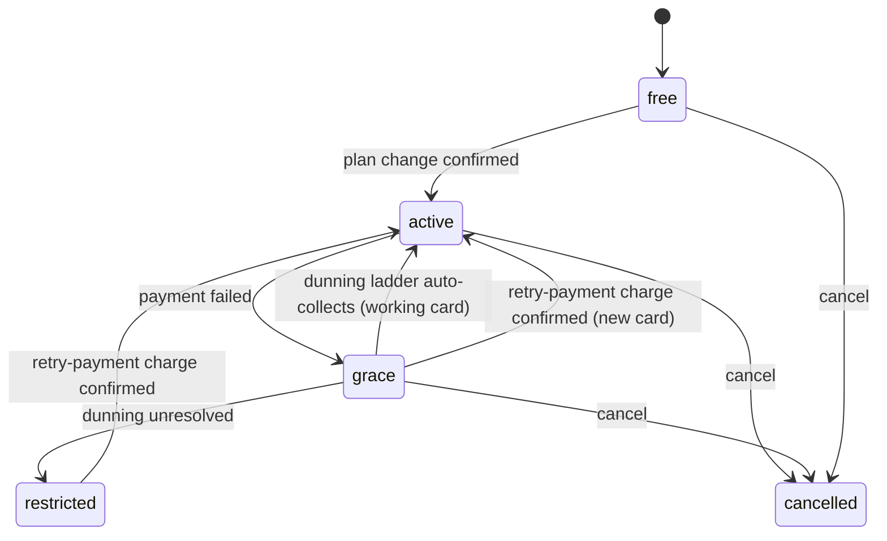
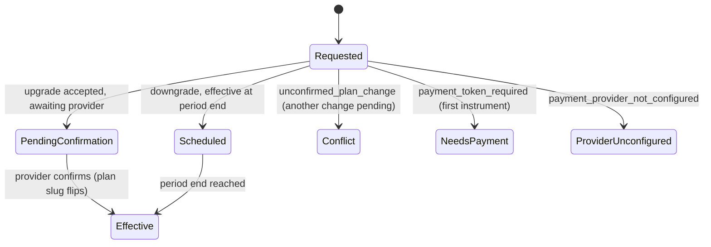
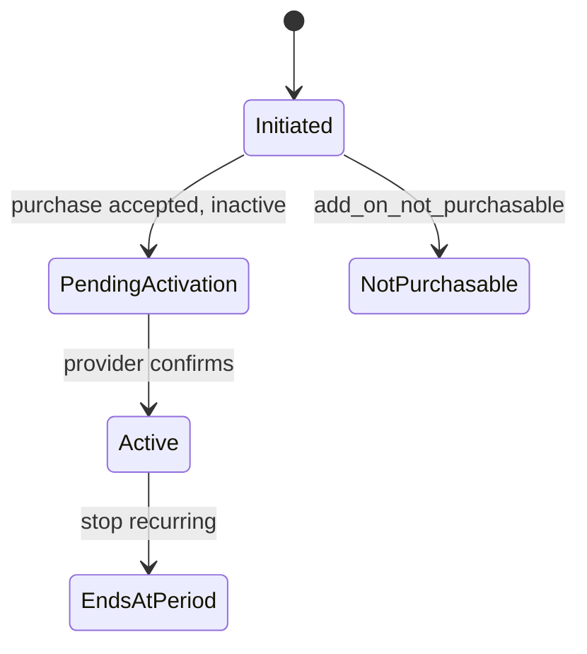
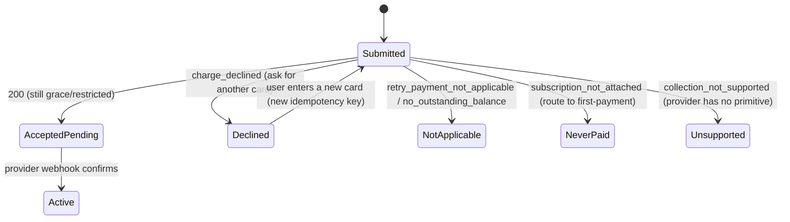

# Billing Plans and Limits (Frontend) — Spec

> Reflects two backend handoffs — the original billing surface (2026-07-21) and the contract-hardening pass (2026-08-11) — both merged and live on the backend, plus the resolved product decisions from the scoping interview. The hardening pass added a stable machine-readable error `code` on every billing error, closed the document-type field to a nine-value enum on write, and added the real grace-recovery endpoint (`retry-payment`).

## 1. Business Context

The backend shipped a complete billing surface — plan catalog, subscription, plan changes, capacity add-ons, usage metering, usage-ledger history, and plan-derived limit enforcement across resource creation — then hardened its error contract. It is live but inert on limits: every organization is seeded on an "unlimited" plan whose ceilings are all null, so the enforcement code runs but blocks nobody. Real plans with real ceilings, and the failed-payment "restricted" state, are a separate future rollout.

The web app has **no billing surface today**. There is no billing-profile screen, no plan picker, no usage view, and no handling for the new "payment required" rejection. So nothing in the current app is broken by the contract change right now — there is no code correlating the old identifiers, and no non-admin write path to reject. The work is therefore **net-new**, and the requirement is to build that surface adopting the new contract correctly from day one, so that when real plans and ceilings roll out the app already behaves correctly with zero further changes.

The hardening pass matters because it changes *how* the app must read errors: billing errors now carry a stable `code` (snake_case, never reworded once shipped) alongside a human-readable `detail` (English, may change wording, not for display or matching). The app must branch on `code`, never on message text — including distinguishing two different `402` responses that share the same status.

The payment provider is **Stripe** — the only provider an organization is routed to today; there is no MercadoPago account yet. The backend exposes both providers behind one abstraction, and the app reads the resolved provider and its browser-safe publishable key at runtime, so a later MercadoPago rollout is an incremental addition rather than a rewrite.

Who cares this lands:
- **Organization admins / billing owners** — the people who will pick a plan, add capacity, replace a dead card, settle balances, and reconcile the usage ledger. Today they cannot self-serve any of this in the app.
- **All members** — anyone who creates a resource (invites a teammate, adds a calendar, schedules an event) can hit a capacity ceiling once real plans exist; they need to understand what happened and where to go.
- **Product / growth** — self-serve upgrade and add-on purchase is the paid-conversion path.
- **Partner integrations** — token-authenticated event creation can hit the same ceilings; out of scope for this frontend feature, but the shared error contract is the same.

Cost of doing nothing: when real plans roll out, resource-creation flows would fail with an error the app has never seen and cannot explain; a payer with a genuinely dead card would have no in-app way to replace it and settle; and there would be no way to view a plan, buy capacity, reconcile usage, or manage the billing profile from the product at all.

This is a **known requirement**, not a hypothesis — the backend contract is fixed and live, and the app must conform to it.

## 2. Hypothesis (to be validated)

Not a hypothesis — known requirement driven by a live, fixed backend contract plus an upcoming plan rollout the app must be ready for. Correctness and completeness against the contract matter; there is no metric to validate or roll back against.

## 3. Objectives (and definition of done)

1. **Billing profile is manageable in-app under the new ownership and document-type model.**
   - Signal: an admin can create and edit the organization's billing profile, including the now-required contact name and email and a document type constrained to the nine allowed values; a non-admin who attempts a write gets a clear, non-broken message instead of a raw failure.
   - Source: the billing-profile screens and their tests.
   - Done when: create / edit work for admins against the active organization; the profile is keyed by organization; document-type input is constrained to the enum on write while reads tolerate legacy out-of-set values; a rejected non-admin write is handled gracefully.

2. **Every billing error is read by its stable `code`, and every guarded write path surfaces the "limit exceeded" rejection gracefully and routes to the right remedy.**
   - Signal: error handling branches on the machine-readable `code` (never on `detail` text); each guarded create/mutation, when it receives the over-limit rejection, shows a clear message and routes to the matching remedy (buy add-on, upgrade plan, add a card, or settle balance); the two `402` codes (`limit_exceeded` vs `charge_declined`) are distinguished.
   - Source: a shared error-handling path plus tests that simulate each error body on each guarded operation.
   - Done when: billing errors are parsed into a typed error keyed on `code`, field-validation errors (which carry no `code`) are handled separately, and over-limit rejections route by remedy on every user-reachable guarded operation (see Use-cases) — verified by tests even though the over-limit case cannot fire in production yet.

3. **Admins can self-serve the full billing lifecycle, including recovering a dead card and reconciling usage.**
   - Signal: an admin can view plans and the current subscription, change plan (upgrade or downgrade), cancel, view current usage and the period-by-period usage ledger, purchase / stop an add-on including first-time card capture, and — for a subscription in grace with a genuinely dead card — replace the card and collect the outstanding balance via the retry-payment path.
   - Source: the billing area and its tests.
   - Done when: all of the above complete end to end, with pending/asynchronous states reflected (via polling) until the provider confirms, and a declined replacement card handled as an ordinary "try another card" outcome rather than a generic error.

4. **No regressions for multi-organization and non-admin users.**
   - Signal: users belonging to more than one organization, and non-admin members, continue to use the app normally; billing requests carry the active-organization context and resolve the correct organization.
   - Source: regression tests across multi-org and role scenarios.
   - Done when: the existing active-organization and role behavior is preserved and the billing screens honor it.

**Overall definition of done:** no regressions for multi-org / non-admin users, and every guarded write path surfaces the rejection gracefully — all verified by tests — even though the over-limit rejection cannot fire in production until the future plan rollout.

## 4. Decisions

### 4.1 Use-cases

1. **Admin creates the billing profile.**
   - Actor: an organization admin.
   - Trigger: opens the billing profile screen for an organization that has none.
   - Flow:
     1. Sees an empty profile form requiring a contact first name and contact email, with optional last name, phone, document number, and billing address, and a document type chosen from the nine allowed values.
     2. Fills the required fields and submits.
     3. The request carries the active-organization context.
     4. The profile is created and shown, keyed to the organization.
   - Outcome: the organization has exactly one billing profile; a second create attempt is reported as "already exists" rather than creating a duplicate.

2. **Non-admin member tries to edit the billing profile.**
   - Actor: a member who is not an admin.
   - Trigger: opens the billing profile screen and attempts to save an edit.
   - Flow:
     1. Can view the profile — including a document type that may be a legacy value outside the nine (reads are permissive).
     2. Submits a change.
     3. The write is rejected because writes are admin-only.
     4. The app shows a clear "only organization admins can edit billing" message and leaves the form unchanged.
   - Outcome: no data changes; the member understands why and who can do it.

3. **Member hits a capacity ceiling while creating a resource.**
   - Actor: any member.
   - Trigger: performs a user-reachable guarded create (see the guarded-operations list below) when the organization is at its ceiling for that resource.
   - Flow:
     1. Submits the create.
     2. The operation is rejected with the over-limit contract (`code: limit_exceeded`) naming the resource and a remedy.
     3. The app rolls the UI back to the pre-submit state (nothing was persisted server-side) and shows a message built from the rejection.
     4. The app routes the user to the remedy: buy more capacity, upgrade the plan, add a card, or settle the balance.
   - Outcome: the user is not left with a silent or cryptic failure; they land on the action that unblocks them.

   **User-reachable guarded operations to carry remedy routing (REST, this app):**
   - Invite a teammate — resource `organization_members`.
   - Reactivate a member — resource `organization_members`.
   - Create a resource calendar — resource `resource_calendars`.
   - Create a bundle calendar — resource `bundle_calendars`.
   - Create a calendar group — resource `calendar_groups`.
   - Create / batch-modify availability windows — resource `availability_windows`.
   - Create a webhook configuration — resource `webhook_subscriptions`.
   - Create a system user / token — resource `public_api_system_users`.
   - Create a calendar event / booking — resource `event_occurrences` (post-paid; the remedy here is add-a-card rather than buy-add-on).

   The shared handler covers any guarded write globally, so an operation not individually wired (for example a group-scoped availability upsert that has no REST screen today, or an internally-reached event path) still degrades gracefully if it ever returns the rejection.

3a. **A note on "today":** because every organization is currently on an unlimited plan, this rejection cannot occur in production yet. The handling is built and tested now so the future rollout requires no client change.

4. **Admin views plans and changes plan.**
   - Actor: an admin / billing owner.
   - Trigger: opens the plan picker.
   - Flow:
     1. Sees the active plans available for the organization's currency, with a monthly / annual toggle where an annual price exists, and each plan's limits and feature entitlements.
     2. Picks a target plan and interval and confirms.
     3. If this is the first time the organization attaches a payment instrument, the app captures card details through the provider (using the runtime publishable key) and obtains a payment token to include; otherwise it omits the token. If the token is required but absent, the server rejects with `code: payment_token_required` and the app prompts for a card rather than throwing.
     4. The app sends the change with a fresh idempotency key.
     5. For an upgrade, capacity is not granted synchronously — the app shows a pending state and polls the subscription until the plan takes effect. For a downgrade, the app shows that the change is scheduled to take effect at period end.
   - Outcome: the subscription reflects the requested change (immediately for a scheduled downgrade marker; after provider confirmation for an upgrade). A competing change while one is pending is refused with `code: unconfirmed_plan_change`, and a deployment whose provider is not configured with `code: payment_provider_not_configured`; both are shown as distinct messages.

5. **Admin purchases a capacity add-on.**
   - Actor: an admin / billing owner.
   - Trigger: opens the add-on purchase flow (directly, or routed there by a "buy more capacity" remedy).
   - Flow:
     1. Chooses a resource and quantity for a resource the current plan sells overage on.
     2. Confirms; the app captures card details if no instrument is on file, and sends the purchase with a fresh idempotency key.
     3. The add-on is returned inactive; the app shows it as pending activation and polls until it activates.
   - Outcome: once the provider confirms, the add-on is active and the organization's effective ceiling for that resource increases. A resource with no overage price is rejected with `code: add_on_not_purchasable` and surfaced on the field; a provider-not-configured deployment with `code: payment_provider_not_configured`.

6. **Any member views current usage.**
   - Actor: any member.
   - Trigger: opens the usage view.
   - Flow:
     1. Sees one meter per limited resource with current usage against the effective ceiling.
     2. A resource with no ceiling is shown as unlimited (∞), never as a full bar.
   - Outcome: the member understands current consumption. This view stays readable even when the organization is restricted.

7. **Admin reconciles the usage ledger / billing history.**
   - Actor: an admin / billing owner (the line-item ledger is admin-only; the period list is readable by any member).
   - Trigger: opens the billing history view.
   - Flow:
     1. Sees the list of billing periods for the organization's pooled billing subtree.
     2. Drills into a period to see the line-item ledger of metered occurrences behind post-paid charges, filterable by period, allowance side, organization (within the subtree), and occurrence-start range.
   - Outcome: an admin can tie post-paid charges back to specific occurrences to reconcile or dispute them. This is the app's stand-in for "invoice/receipt history"; there is no separate formal-invoice document surface (see Negative scope).

8. **Admin recovers a subscription in grace with a dead card.**
   - Actor: an admin / billing owner of a subscription in grace (or restricted).
   - Trigger: sees the grace/restricted banner and follows it, or is routed there by an "add a card" / "settle balance" remedy.
   - Flow:
     1. Sees that a payment failed; if the card still works, the automatic dunning ladder may already be recovering the subscription without any action, so the app reflects the current state rather than forcing a retry.
     2. To replace a genuinely dead or expired card, the admin enters new card details, the app tokenizes them through the provider, and submits the retry-payment request with the token and one idempotency key held across any resubmits of the same attempt.
     3. The request returns success only meaning the provider accepted the attempt — the subscription is still in grace/restricted at that point. The app shows a pending state and polls the subscription until it becomes active; it does not claim "payment successful" off the acceptance alone.
     4. If the provider declines the card (`code: charge_declined`), the app treats it as an ordinary outcome and asks for a different card, generating a new idempotency key for that genuinely new attempt; it prefers refetching the subscription over asserting nothing was charged (a later invoice can decline while an earlier one was collected).
     5. The app shows a distinct message for each non-applicable case: nothing to retry (`retry_payment_not_applicable`), never-paid (`subscription_not_attached` — route to the first-payment / upgrade flow instead), nothing owed (`no_outstanding_balance`), or the provider has no collection primitive (`collection_not_supported`).
   - Outcome: once the provider confirms the charge, the subscription returns to active and writes resume.

9. **Admin cancels the subscription.**
   - Actor: an admin / billing owner.
   - Trigger: chooses to cancel.
   - Flow:
     1. Confirms the cancellation.
     2. The subscription transitions toward cancelled.
   - Outcome: the subscription reflects the cancellation.

### 4.2 State transitions & edge cases

**Billing state (drives global banners and the restricted behavior):**

- **free / active** — normal; no banner blocking, full functionality.
- **grace** — a payment failed but nothing is blocked yet; the app shows an informational banner but does not block writes. A subscription here may recover automatically (the dunning ladder now genuinely collects on its scheduled retry when the instrument still works) or via retry-payment for a dead card.
- **restricted** — writes are blocked with the over-limit contract carrying the restricted-state marker and the settle-balance remedy; reads, exports, and the entire billing area stay open; the app shows a prominent restricted banner routing to the retry-payment recovery path.
- **cancelled** — surfaced in the subscription view.

**Plan-change lifecycle (as the app observes it):**

- **PendingConfirmation** — the app shows a pending state and polls the subscription until the plan takes effect; it does not assume the upgrade is effective on the accepted response.
- **Scheduled** — the app shows the pending plan and its effective date.
- **Conflict** (`unconfirmed_plan_change`) — a different change is already awaiting confirmation; the app tells the user to wait for it to settle and does not send a competing change.
- **NeedsPayment** (`payment_token_required`) — the app captures a card and retries with a token.
- **ProviderUnconfigured** (`payment_provider_not_configured`) — shown as a distinct, non-actionable configuration message.

**Add-on lifecycle:**

- A purchased add-on is returned inactive; the app shows "pending activation" and polls until active.
- Stopping a recurring add-on marks it to not renew at period end; existing capacity holds until then.

**Grace-recovery (retry-payment) lifecycle:**

**Payment provider & credentials:**

- The app reads the resolved payment provider and its browser-safe public credentials at runtime from the payment-provider endpoint (an authenticated form and an unauthenticated `/default/` sibling). Only the resolved provider's credentials are populated; the other is null, so the client never receives keys for a provider it did not resolve to.
- **Stripe is the provider today** — the only one an organization is routed to; the app initializes Stripe card tokenization from the returned publishable key. MercadoPago is defined in the contract but has no account yet and is not built in this feature (see Negative scope / Open questions).

**Edge cases and decided handling:**

- **Branch on `code`, never on `detail`.** All billing errors share a two-field body (`code`, `detail`). The app keys its handling on `code`; `detail` is used only for logs/debugging, never for display or string-matching. Two `402` responses share the status — `limit_exceeded` (over capacity) and `charge_declined` (card declined) — and are told apart by `code`.
- **Field-validation errors have no `code`.** Ordinary field-validation rejections (for example a missing required field) keep their field-keyed shape and carry no `code`; the app handles these as form-field errors, separately from the coded billing error body. The error layer must tolerate both shapes without throwing on the absent key — especially on the payment screens the hardening pass called out.
- **`document_type` is a closed enum on write, open on read.** The write control is constrained to the nine allowed values; a value outside the set is rejected. Reads are permissive — legacy rows were not backfilled and can return a value outside the nine — so the read model treats it as an open string and does not fail parsing on a legacy value.
- **`charge_declined` with multiple invoices.** A decline can arrive after an earlier invoice was collected; the app prefers refetching the subscription to reflect true state over telling the user unconditionally that nothing was charged.
- **Ledger permission is stricter than the rest of billing.** The metered-occurrence ledger is admin / billing-owner only (it exposes calendar content across the pooled subtree), while the period list and current-usage views stay open to any member; the app gates the ledger drill-in accordingly.
- **Multi-organization caller** — the active-organization context is required for callers with two or more memberships; the app already resolves and sends this on every request. Billing screens honor the active organization and re-fetch on switch.
- **Wrong / non-member organization context** — resolved by the app's existing organization-error recovery (re-pick and retry).
- **Billing profile keyed by organization** — the profile identifier now identifies the organization, not a user; the app treats one profile per organization and never correlates the identifier to a user. A second create is reported as a conflict.
- **Required contact fields missing** — a create/edit omitting the required contact name or email is rejected as a field error; the form validates these before submit and surfaces server rejections field-by-field.
- **Non-admin write** — rejected; shown as an admin-only message, form left intact.
- **Unlimited / not-included limits** — a null ceiling is "unlimited" (∞); a zero ceiling is "not included"; these are visually distinct and never rendered as a full bar at zero. Today every ceiling is null.
- **Restricted reads** — usage, the ledger, and every billing screen remain readable while restricted.
- **No subscription** — the subscription and usage screens handle "this organization has no subscription" without erroring the app.
- **Reseller / child organization** — reads resolve against the organization's billing root (a child sees the pooled, parent-level subscription, usage, and ledger); the app displays these read values but offers no reseller management UI (see Negative scope).

**Idempotency:** plan changes, add-on purchases, and retry-payment are idempotent on a client-generated key. The app generates one key per distinct user intent and reuses that same key on any retry of the *same* submission (double-click, network retry), so the provider collapses it into a single charge. A genuinely new attempt — for example a second card after the first was declined — uses a **new** key, which is deliberately allowed to drive a second charge attempt. Generating a fresh key on an automatic retry of the same submission would risk double-charging, so keys are generated once per intent and held across retries.

**Concurrency:** a plan change while another is already awaiting confirmation is a conflict (`unconfirmed_plan_change`); the app surfaces "a change is already pending" and does not issue a competing change. Billing-profile edits use last-write-wins at the field level as the server allows; the admin-only gate is the primary guard.

**Time-bounded behavior:** downgrades take effect at the end of the current billing period (the app shows the effective date, does not apply it early). Upgrades, add-ons, and retry-payment resolve asynchronously on provider confirmation; the app polls until the observable state changes rather than assuming immediate effect. The app does not itself run timers for grace/restriction — it reflects the state the server reports, including automatic recovery driven by the dunning ladder.

### 4.3 Acceptance scenarios

1. **Happy — admin creates a billing profile with a valid document type.**
   Given an admin viewing an organization with no billing profile, when they submit the form with a contact first name, contact email, and a document type from the nine allowed values, then the profile is created, shown, and keyed to the organization, and a subsequent create attempt is reported as already existing rather than duplicated.

2. **Error — document type outside the enum is rejected on write; legacy value survives on read.**
   Given an admin editing the profile, when they submit a document type outside the nine values, then the write is rejected and the control shows the constraint; and given a profile whose stored document type predates the enum, when the profile is read, then the legacy value is displayed without breaking the screen.

3. **Error — non-admin edit is rejected cleanly.**
   Given a non-admin member on the billing profile screen, when they submit an edit, then the write is rejected and the app shows an "only organization admins can edit billing" message with the form unchanged and no data written.

4. **Edge — over-limit routes by remedy, keyed on `code`.**
   Given a user-reachable guarded create that returns `code: limit_exceeded` with a given remedy, when the app receives it, then it is distinguished from other `402` responses by `code`, the pre-submit UI is restored (nothing persisted), a message is shown, and the user is routed to the matching remedy — buy add-on, upgrade plan, add a card, or settle balance — for each of the four remedies.

5. **Edge — usage shows unlimited correctly.**
   Given a usage response where a resource has no ceiling, when the usage view renders, then that resource shows as unlimited (∞) and never as a full bar at zero; and a resource with a positive ceiling shows current usage against it.

6. **Integration/async — upgrade pends until provider confirms.**
   Given an admin who confirms an upgrade, when the change is accepted, then the app shows a pending state and polls the subscription, and only reflects the new plan after the plan takes effect; and if a change is already pending, a second attempt is refused with `unconfirmed_plan_change` and shown as a distinct message.

7. **Async — add-on activates after confirmation; non-purchasable is surfaced.**
   Given an admin who purchases an add-on, when the purchase is accepted and returned inactive, then the app shows it as pending activation and polls until it activates; and when the resource has no overage price, the purchase is rejected with `add_on_not_purchasable` and surfaced on the field.

8. **Grace recovery — retry-payment pends until confirmed; decline asks for another card.**
   Given a subscription in grace, when an admin submits a new card via retry-payment, then the acceptance response does not show "payment successful" — the app shows pending and polls until the subscription becomes active; and when the provider returns `charge_declined`, the app asks for a different card (new idempotency key) and refetches the subscription rather than asserting nothing was charged.

9. **Grace recovery — non-applicable cases show distinct messages.**
   Given a retry-payment attempt where the subscription was never paid, when the server returns `subscription_not_attached`, then the app routes the user to the first-payment / upgrade flow rather than showing a retry error; and `retry_payment_not_applicable`, `no_outstanding_balance`, and `collection_not_supported` each show their own distinct message.

10. **Ledger — admin reconciles a period; non-admin cannot open the ledger.**
   Given an admin, when they open a billing period, then they see the line-item ledger of metered occurrences filterable by period and time range; and given a non-admin member, when they open the billing history, then the period list is visible but the line-item ledger drill-in is not available to them.

11. **Restricted — writes blocked, reads open.**
   Given an organization in the restricted state, when a member opens the app, then a restricted banner routes to the retry-payment recovery path, guarded writes are rejected and routed to the settle-balance remedy, and usage / ledger / billing screens and exports remain readable.

### 4.4 Negative scope

- **Grace recovery via re-affirming the current plan through change-plan** — explicitly not used; it never worked (returns a silent success that moves no money). The only supported grace-recovery path is retry-payment. Reason: documented dead end.
- **MercadoPago card capture / collection** — the provider abstraction includes MercadoPago, but there is no account yet, no organization is routed to it, and its retry-payment collection is unsupported. Only the Stripe path is built and verified in this feature. Reason: no live MercadoPago account.
- **Standalone "manage saved card" while active** — there is no endpoint to view or replace the payment instrument outside a first payment (change-plan / add-on) or grace recovery (retry-payment). The app captures a card only within those flows; a general saved-card management surface is out until the backend exposes one. Reason: no backing endpoint.
- **Formal invoice / receipt documents** — no PDF or line-item *invoice* document surface exists; the usage-ledger history (billing periods + metered-occurrence ledger) is the in-scope reconciliation surface. Reason: no invoice-document endpoint.
- **Reseller / child-organization billing management** — no UI to manage a parent's billing from a child, and no reseller-root acting-as flow. Read values that resolve to the billing root are displayed, but management is out. Reason: distinct permission model and audience.
- **Dunning / grace email flows** — the frontend plays no part in failed-payment email sequences; only the in-app grace/restricted banner. The automatic dunning ladder's collection is a backend concern the app only observes. Reason: server/notification concern.
- **GraphQL error handling** — the app has no GraphQL data layer; the guarded operations exist here as REST calls, so only the REST rejection needs handling. Reason: the GraphQL variant of the contract has no consumer in this app.
- **Active-organization plumbing and the header/role primitives** — already built; this feature consumes them, it does not rebuild them. Reason: existing, mature infrastructure.
- **Partner/token-authenticated event creation flows** — the same ceilings apply server-side, but those are not user-facing screens in this app. Reason: not a UI surface here.
- **Provider webhook handling** — inbound provider callbacks are a backend concern; the app only observes their effect by polling. Reason: not a client responsibility.
- **Backfilling / normalizing legacy `document_type` values** — the app tolerates legacy out-of-set values on read but does not migrate or normalize them. Reason: data migration is a backend concern.

## 5. Alternatives considered

- **Adapt only the breaking changes now, defer the self-serve surface.** Rejected by the requester in favor of building the full surface (profile, plans, subscription, add-ons, usage, ledger, payment capture, remedy routing, grace recovery) in one feature so the future plan rollout is a client no-op.
- **Generic "limit exceeded" message with a single "manage billing" link, remedy routing later.** Rejected in favor of full remedy-specific routing now, so each rejection lands the user on the exact unblocking action.
- **Match errors on the human-readable message string.** Rejected — and now unsupported by the contract; the app branches on the stable `code` and treats `detail` as display/log-only text that may be reworded.
- **Build both provider paths (Stripe + MercadoPago) now.** Rejected in favor of building only Stripe, since it is the only routed provider and there is no MercadoPago account; the app still reads the provider at runtime so MercadoPago can be added later without a rewrite.
- **Admin-only billing area hidden from members.** Rejected in favor of showing billing to all members and handling the admin-only write rejection gracefully, so members can at least view plans, current usage, and the billing-period list.

## 6. Open questions

1. **Polling and pagination defaults for the async and ledger surfaces.** The contract requires polling until state changes (upgrade, add-on, retry-payment) and paginates the usage ledger, but the concrete cadence, timeout/terminal-state, and page sizes are product/UX choices not fixed by the backend.
   - Recommended default: bounded polling with a clear "still processing — check back" terminal state; sensible page sizes for the ledger with newest-first ordering.
   - Who can answer: the implementing team + design during planning.
   - Unblocks: the pending-state and ledger UI details.

2. **When MercadoPago becomes real, what triggers building its path?** It is defined in the contract but has no account today and is out of scope here.
   - Recommended default: treat MercadoPago as a fast-follow gated on an account existing and an organization being routed to it; the runtime provider read means no change is needed until then.
   - Who can answer: the billing backend owner + product.
   - Unblocks: any future MercadoPago work (not this feature).

## 7. Risks assumed

- **Only the Stripe path is exercisable.** Assumption: Stripe is and remains the routed provider for this feature, and the runtime provider read cleanly supports adding MercadoPago later. If an org is unexpectedly routed to MercadoPago before its path exists, its card-capture and collection flows would not work. Mitigation: read the provider at runtime, build Stripe against the documented abstraction, and surface a clear message for any provider the app cannot yet handle. Likelihood: low. Severity: medium.

- **Over-limit remedy routing is built against an inert contract.** Assumption: the over-limit body shape (resource, remedy, usage, ceiling) and the stable `code` set are frozen and match production behavior at rollout. If they drift before real plans ship, routing may mismatch. Mitigation: branch on the machine-readable `code` / `remedy` rather than message text, cover every code and remedy with tests, and treat unknown codes as a safe generic fallback. Likelihood: low. Severity: medium.

- **Restricted-state coverage exceeds the documented responses.** Assumption: some restricted-state write blocks are emitted at runtime even where the spec does not list the rejection among an operation's documented responses. If the app only handles documented cases, it will miss real rejections. Mitigation: handle the rejection defensively on all guarded writes regardless of the documented response list, via the shared global handler. Likelihood: medium. Severity: low.

- **Double-charge on retry-payment via mis-keyed idempotency.** Assumption: the app generates one idempotency key per user intent and holds it across automatic retries of the same submission, using a new key only for a genuinely new card attempt. If an automatic retry regenerates the key, the user can be charged twice. Mitigation: generate the key once at intent time, thread it through retries, and only mint a new one on an explicit new attempt; cover this in tests. Likelihood: low. Severity: high.

- **Async confirmation via polling may lag or hang.** Assumption: the provider confirms within a reasonable window and the subscription/usage reflect it, so polling terminates — this applies to upgrades, add-ons, and retry-payment, none of which are effective on their acceptance response. If confirmation is slow or never arrives, the pending state could persist. Mitigation: bound the polling with a clear terminal "still processing" state rather than spinning indefinitely, and let the user re-open to re-check. Likelihood: low. Severity: low.

- **Mixed error shapes on the same screen.** Assumption: the error layer correctly distinguishes the coded billing error body from field-validation errors (which carry no `code`) and from the two same-status `402` codes. If it conflates them, a payment screen could throw on a missing key or show the wrong message. Mitigation: parse defensively, treat an absent `code` as a field-error path, and test each shape — especially the payment screens. Likelihood: low. Severity: medium.

- **Scope breadth in one feature.** Assumption: profile + plans + subscription + add-ons + usage + ledger + payment capture + grace recovery + full remedy routing can land as one coherent feature without the correctness bar slipping. If breadth outruns the "no regressions + contract coverage" bar, quality is at risk. Mitigation: phase the plan so the read-only and adaptation work (which must be correct-from-day-one) lands and is tested before the transactional/payment work; gate on the test coverage in the objectives. Likelihood: medium. Severity: medium.

- **Accepted, no mitigation:** because limits are inert in production today, none of the over-limit or restricted-state handling can be validated against real production behavior in this feature — only against simulated contracts in tests. This is accepted; the future plan rollout is the first real exercise.
